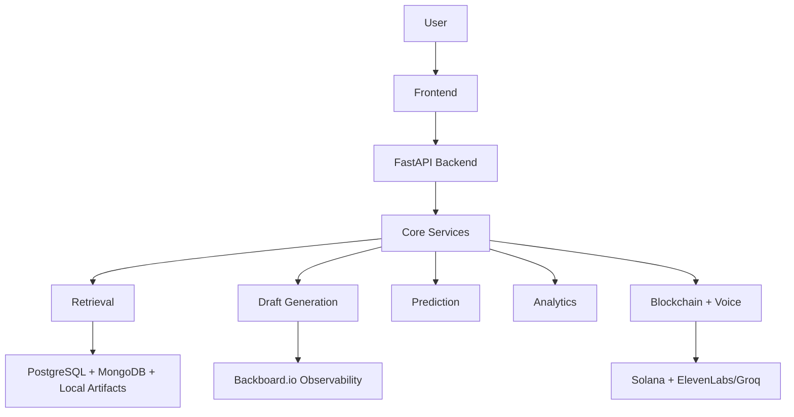

# RTI-Lens Technical Project Report

## 1. Project Overview

RTI-Lens is a full-stack civic-tech platform for the Indian Right to Information (RTI) ecosystem. The system combines:

- hybrid retrieval over CIC precedent data
- query optimization and ministry/section inference
- multi-agent RTI appeal drafting
- outcome prediction using a trained machine-learning model
- workflow observability through Backboard.io
- blockchain anchoring for document integrity
- voice transcription and text-to-speech
- analytics and knowledge-graph visualization

The project is organized as a research-oriented production prototype rather than a single-model demo. Its core contribution is the combination of:

1. retrieval-grounded legal assistance,
2. multi-stage orchestration of LLM and ML components,
3. auditability through workflow logging, and
4. domain-specific preprocessing for RTI data.

---

## 2. Research and Product Goals

The system is designed to support common RTI tasks:

- answering precedent-based legal questions,
- improving the quality of RTI queries,
- generating RTI first appeals,
- predicting whether an appeal/request may be allowed or denied,
- visualizing institutional and statutory patterns,
- providing traceability for generated outputs.

From a publication perspective, the project can be positioned as a hybrid AI legal-assistance system with:

- retrieval-augmented generation,
- model orchestration,
- structured legal drafting,
- evaluation and observability,
- and provenance-preserving storage.

---

## 3. Repository Structure

### 3.1 Top-Level Areas

- `backend/` - FastAPI application, APIs, models, utilities, workflow/session tracking
- `frontend/` - React + TypeScript dashboard and user-facing interface
- `app/services/` - query optimization service layer
- `data/` - generated corpora, indexes, metadata, model artifacts
- `scripts/` - offline build scripts for indexes, graphs, embeddings, and data prep
- `step1_*.py` to `step5_*.py` - orchestration scripts for initial data processing
- `migrations/sql/` - database schema and migration SQL
- `components/` - timeline visualization component used outside the main frontend app
- `bin/` - shell scripts for starting backend/frontend and setup flows

### 3.2 Key Entry Points

- Backend application bootstrap: `backend/main.py`
- Draft generation API: `backend/routers/draft.py`
- Q&A API: `backend/routers/qa.py`
- Query assistant API: `backend/routers/query_assistant.py`
- Outcome prediction API: `backend/routers/predict.py`
- Analytics APIs: `backend/routers/analytics.py`, `backend/routers/dashboard.py`, `backend/routers/graph.py`
- Blockchain APIs: `backend/routers/blockchain.py`
- Voice APIs: `backend/routers/voice.py`
- Frontend route map: `frontend/src/App.tsx`

---

## 4. High-Level Architecture

### 4.1 System Design Interpretation

The architecture is modular and layered:

- presentation layer: the React UI
- service layer: FastAPI routers and service classes
- retrieval layer: BM25, vector search, PageIndex verification
- generation layer: Groq agents + Gemini orchestration
- analytics and visualization layer: DB-backed endpoints and graphs
- persistence layer: PostgreSQL, MongoDB, local artifacts
- observability layer: Backboard workflow sessions and actions

This separation makes the system suitable for a paper because each stage can be described, benchmarked, and ablated independently.

---

## 5. Data and Corpus

### 5.1 Corpus Sources

The project uses CIC order data as the core legal corpus. The repo documentation indicates:

- approximately 713 CIC documents
- approximately 5,251 vector chunks
- average chunking of roughly 7.4 chunks per document
- 384-dimensional embeddings using `all-MiniLM-L6-v2`

### 5.2 Data Directory

The `data/` directory stores both raw and generated artifacts:

- `data/cic_orders_txt/` - raw CIC order text files
- `data/cic_orders_md/` - generated markdown renderings of orders
- `data/pageindex_trees/` - PageIndex hierarchical JSON trees
- `data/bm25_pageindex.pkl` - BM25 search index
- `data/model.pkl` - outcome prediction model
- `data/model_card.json` - model metadata and metrics
- `data/dashboard_graph.json` - dashboard graph payload
- `data/order_number_mapping.json` - order-number to hash mapping

### 5.2.1 What is actually embedded and stored in MongoDB?

No, not every file in the repository is embedded.

The vector pipeline specifically processes the generated markdown corpus in `data/cic_orders_md/`, which itself is produced from the CIC order source files. The embedding builder:

- iterates over `data/cic_orders_md/*.md`
- reads each markdown order file
- chunks the document into overlapping word windows
- generates semantic embeddings for each chunk
- stores one MongoDB document per chunk

This means MongoDB stores the chunked document representation, not the entire repository and not unrelated project files.

### 5.2.2 Chunking and storage details

The embedding builder uses the following chunking strategy:

- chunk size: 500 words
- overlap: 100 words
- fallback: if a document is shorter than 500 words, the full document is stored as one chunk
- chunk metadata:
  - `order_number`
  - `order_hash`
  - `ministry`
  - `section_cited`
  - `appeal_outcome`
  - `appeal_level`
  - `order_date`
  - `text`
  - `title`
  - `hierarchy`
  - `depth`
  - `line_num`
  - `chunk_index`
  - `embedding`

The script writes one MongoDB record per chunk, so a single document can produce multiple stored records.

### 5.2.3 MongoDB collection and vector index

The embedding builder stores records in the collection configured by:

- `MONGODB_DB`
- `MONGODB_COLLECTION`
- `MONGODB_VECTOR_INDEX`

Indexing includes:

- regular ascending indexes on:
  - `order_number`
  - `order_hash`
  - `ministry`
  - `section_cited`
  - `order_date`
- a MongoDB vector search index over:
  - `embedding`
  - `ministry`
  - `section_cited`
  - `order_date`
  - `appeal_outcome`

The vector dimension is `384`, matching `all-MiniLM-L6-v2`.

### 5.2.4 Retrieval fallback behavior

The semantic retrieval layer tries the MongoDB vector search first. If that fails, it falls back to:

- in-memory cosine similarity over the stored embedding vectors

If vector search is unavailable in the Q&A or query assistant flows, the system can also fall back to BM25-only retrieval.

### 5.2.5 Embedding summary table

| Item | Value |
|------|-------|
| Markdown files embedded | 713 |
| Total embedded chunks | 5,251 |
| Average chunks per file | 7.4 |
| Chunk size | 500 words |
| Chunk overlap | 100 words |
| Embedding model | `all-MiniLM-L6-v2` |
| Vector dimension | 384 |
| MongoDB database | `MONGODB_DB` / `rtilens_vectors` default |
| MongoDB collection | `MONGODB_COLLECTION` / `document_embeddings` default |
| Vector index name | `MONGODB_VECTOR_INDEX` / `vector_index` default |
| Stored per-chunk fields | order metadata, chunk text, hierarchy, depth, line number, embedding |

### 5.3 Model Card Facts

The saved model metadata reports:

- model type: RandomForest
- accuracy: 0.8205
- F1 score: 0.8372
- training size: 311
- test size: 78
- class distribution: 200 positive / 189 negative
- low-data threshold: 10

This is useful for a paper because it provides a compact baseline summary of the supervised model used in the platform.

### 5.4 Evaluation Artifact Note

The saved `data/eval_results.json` file contains a sample evaluation with:

- faithfulness: 1.0
- context precision: 0.9999999999
- context recall: 1.0
- answer relevancy: NaN

Important caveat:

- the example text in that artifact is not domain-realistic
- for publication, you should regenerate evaluation on representative RTI tasks rather than rely on this placeholder sample

---

## 6. Data Processing Pipeline

The project uses a multi-step offline build pipeline:

### Step 1: PostgreSQL ingestion

File: `step1_ingest_postgres.py`

Responsibilities:

- clears workflow and case-related tables
- reads JSONL input
- creates ministry records
- inserts cases into `cases`
- inserts paragraphs into `paragraphs`

Notable implementation details:

- uses SQLAlchemy `create_engine`
- uses a simple ministry cache to reduce duplicate inserts
- stores the full raw text in `cases.raw_text`
- stores paragraph-level text in a normalized `paragraphs` table

### Step 2: Markdown and MongoDB document creation

File: `step2_create_markdown_mongodb.py`

Responsibilities:

- converts each case into a markdown file
- writes a metadata header containing ministry, section, date, and outcome
- stores document-level data in MongoDB
- creates the order-number to hash mapping

### Step 3: PageIndex tree building

File: `step3_build_pageindex.py`

Responsibilities:

- runs PageIndex on markdown documents
- stores the generated tree JSONs in `data/pageindex_trees/`
- preserves hierarchical structure for retrieval verification

### Step 4: BM25 index building

File: `step4_build_bm25.py`

Responsibilities:

- loads paragraphs from PostgreSQL
- tokenizes them with section-aware tokenization
- builds a BM25Okapi index
- stores the BM25 object plus paragraph index in `data/bm25_pageindex.pkl`

### Step 5: Vector embeddings

File: `step5_build_embeddings.py`

Responsibilities:

- delegates to the embeddings build script
- populates MongoDB with semantic vectors

The underlying embedding script, `scripts/build_embeddings.py`, is more specific:

- loads the markdown corpus
- loads the order-number mapping from `data/order_number_mapping.json`
- loads case metadata from PostgreSQL
- chunks each markdown file using a 500-word sliding window with 100-word overlap
- generates embeddings with `all-MiniLM-L6-v2`
- stores chunk-level documents in MongoDB
- creates the MongoDB vector search index

### 6.1 Embedding script summary

The embedding builder is the primary source of truth for semantic storage in the project.

Stored chunks are designed for retrieval, not archival:

- the chunk text is the retrieval unit
- the full order remains in markdown form
- the database stores metadata for filtering and traceability
- the vector field is used for semantic search

This design helps the project support:

- precedent retrieval,
- filtered retrieval,
- hybrid fusion with BM25,
- and explainable source assembly.

### Additional scripts

- `scripts/build_embeddings.py` - builds and stores embeddings
- `scripts/build_dashboard_graph.py` - generates dashboard graph JSON
- `scripts/build_knowledge_graph.py` - generates a NetworkX knowledge graph
- `scripts/build_order_mapping.py` - creates order mapping artifacts
- `scripts/generate_pickle_hashes.py` - integrity hashes for pickle artifacts
- `scripts/compute_stats.py` - corpus/statistics generation
- `scripts/validate_pageindex.py` - validates tree outputs
- `scripts/eval_ragas.py` - evaluation helper

---

## 7. Backend Module Report

## 7.1 `backend/main.py`

Role:

- application bootstrap
- router registration
- CORS setup
- root and health endpoints

Important behaviors:

- registers REST routers for analytics, prediction, graph, dashboard, QA, draft, query assistant, blockchain, and voice
- exposes `/health` that checks:
  - BM25 availability
  - PageIndex mapping count
  - database connectivity and case count

### Publication note

This file is your canonical system entry point. In a paper, it can be described as the orchestration shell that unifies retrieval, generation, analytics, and external services.

## 7.2 `backend/config.py`

Role:

- central runtime configuration

Contains:

- database URL
- API keys
- server host and port
- rate limits
- model paths
- model names
- vector store settings
- embedding model and dimension
- hybrid retrieval weights
- Backboard enable switch
- Solana RPC configuration

This module matters because it defines the project’s deployment envelope and the tunable parameters for experimentation.

## 7.3 `backend/schemas.py`

Role:

- Pydantic request/response contracts

Key request models:

- `QARequest`
- `DraftRequest`
- `PredictRequest`

Key response models:

- `QAResponse`
- `DraftResponse`
- `PredictResponse`
- analytics and graph response objects

Why it matters:

- schemas define the API surface
- they document expected inputs and outputs
- they are useful for paper figures showing system contracts

## 7.4 `backend/models.py`

Role:

- SQLAlchemy ORM definitions for persistent entities

Core tables:

- `ministries`
- `cases`
- `paragraphs`
- `ministry_stats`
- `section_stats`
- `blockchain_filings`

Important constraints:

- unique `order_number`
- non-empty text constraints
- valid range constraints for rates and counts
- referential integrity from cases to ministries

## 7.5 `backend/models/workflow.py`

Role:

- workflow session persistence for audit trails

Entities:

- `WorkflowSession`
- `WorkflowAction`

Tracked fields:

- session ID
- Backboard thread ID
- workflow type
- workflow stage
- session metadata
- retrieval history
- generation history
- action logs and error states

This is central to the paper because it provides traceability and reproducibility of AI outputs.

## 7.6 `backend/routers/qa.py`

Role:

- hybrid Q&A endpoint grounded in precedent retrieval

Pipeline:

1. create workflow session
2. sanitize the question
3. run BM25 retrieval
4. optionally run semantic retrieval
5. hybrid merge or fallback to BM25
6. deduplicate by order number
7. PageIndex verification and section extraction
8. build context blocks
9. generate answer with Groq
10. evaluate with RAGAS or a fallback evaluator
11. return answer, sources, confidence, and retrieval metadata

Important implementation details:

- session call tracking is stored in-memory per IP/session
- `top_k` is user-configurable, bounded between 1 and 20
- a clarification response is generated when retrieval confidence is low

## 7.7 `backend/routers/draft.py`

Role:

- multi-agent appeal generation endpoint

Current flow:

1. create workflow session
2. sanitize user context
3. infer first-appeal metadata
4. retrieve precedents
5. derive ministry and section guidance
6. run three Groq agents in parallel
7. score each draft with the prediction model
8. filter to accepted results
9. orchestrate the best draft with Gemini
10. normalize the draft into filing-ready form
11. set addressee to the First Appellate Authority
12. return draft, sources, trace, and transparency payloads

Important recent behavior:

- list-shaped model outputs are normalized before downstream `.get()` calls
- structured draft sections are converted into readable bullets
- raw JSON leaks are cleaned from `Grounds` and `Prayer / Reliefs`
- a fallback first-appeal formatter helps ensure output quality

This endpoint is one of the most paper-worthy parts of the system because it combines:

- retrieval,
- generative drafting,
- machine learning scoring,
- LLM orchestration,
- and deterministic post-processing.

## 7.8 `backend/routers/predict.py`

Role:

- supervised outcome prediction

Pipeline:

1. load model and model card with integrity verification
2. validate ministry, section, raw text
3. construct feature dataframe
4. run `predict` and `predict_proba`
5. map result to `allowed` or `denied`
6. estimate confidence level
7. query the database for ministry training-data coverage
8. return prediction plus disclaimer

Model metadata:

- RandomForest
- 0.8205 accuracy
- 0.8372 F1

## 7.9 `backend/routers/analytics.py`

Role:

- ministry-level and section-level analytics

Endpoints:

- `/api/analytics/denial-rates`
- `/api/analytics/section-heatmap`
- `/api/analytics/override-trends`
- `/api/analytics/ministry/{ministry_id}/orders`
- `/api/analytics/graph`

Analytics are computed from the ORM tables and graph artifact, making this module useful for empirical paper figures.

## 7.10 `backend/routers/dashboard.py`

Role:

- dashboard graph and summary stats

Endpoints:

- `/api/dashboard/graph`
- `/api/dashboard/stats`
- `/api/ministries`

It serves a more presentation-oriented graph payload and aggregate counts for the frontend dashboard.

## 7.11 `backend/routers/query_assistant.py`

Role:

- query optimization assistant

The module uses `app.services.query_optimizer.QueryOptimizer` to:

- extract entities
- infer legal topic
- infer query intent
- detect exemptions
- retrieve precedents
- recommend ministries and sections
- produce a rewritten query

This module is distinct from the draft assistant: it optimizes RTI questions, not appeals.

## 7.12 `backend/routers/blockchain.py`

Role:

- document anchoring and verification via Solana

Capabilities:

- submit RTI document hash
- query filing history by wallet
- verify a document hash
- expose authority public key
- demonstrate encryption/decryption flows for the government simulation

Anchoring mechanism:

- uses Solana devnet by default
- stores RTI metadata in the memo program
- falls back to simulation mode if no private key exists

## 7.13 `backend/routers/voice.py`

Role:

- speech-to-text and text-to-speech

STT flow:

1. try ElevenLabs Scribe
2. fallback to Groq Whisper

TTS flow:

1. ElevenLabs text-to-speech
2. return audio/mpeg payload

## 7.14 `backend/utils/bm25_loader.py`

Role:

- lexical retrieval over paragraph-level records

Features:

- loads the BM25 pickle with hash verification
- supports metadata filtering by ministry, section, and date
- tokenization preserves RTI section patterns such as `8(1)(a)`
- returns paragraph objects with scores and metadata

This is a strong publication point because the retrieval is not naive bag-of-words only; it is section-aware.

## 7.15 `backend/utils/vector_search.py`

Role:

- semantic retrieval over MongoDB embeddings

Features:

- loads sentence-transformer embedding model
- connects to MongoDB
- uses MongoDB `$vectorSearch` when available
- falls back to in-memory cosine similarity scan if needed
- combines semantic and BM25 results using weighted fusion
- optionally applies structural boosts

Important constants:

- embedding model: `all-MiniLM-L6-v2`
- embedding dimension: 384
- BM25 weight: 0.4
- semantic weight: 0.6

## 7.16 `backend/utils/pageindex_loader.py`

Role:

- hierarchical tree retrieval and verification

Capabilities:

- loads order-number mapping
- loads PageIndex JSON trees
- extracts markdown text by line range
- scores and ranks tree nodes based on query keywords
- returns relevant hierarchical sections for context assembly

This module provides a structural layer above raw retrieval, which is important for explainability.

## 7.17 `backend/utils/session_manager.py`

Role:

- session persistence and workflow logging

Responsibilities:

- create workflow session records
- coordinate with Backboard
- update workflow stage
- log retrieval operations
- log generation and state transitions
- write detailed action records to the database

The workflow stage model typically moves through:

- initiated
- retrieval
- generation
- review
- completed

## 7.18 `backend/utils/backboard_client.py`

Role:

- wrapper around Backboard.io SDK

Important point:

- Backboard sits above the retrieval pipeline
- it does not replace MongoDB, BM25, vector search, or Groq generation

The client is used to:

- create workflow threads
- update workflow state
- log retrieval and generation events
- restore workflow context

## 7.19 `backend/utils/confidence_scorer.py`

Role:

- multimodal confidence scoring for retrieval-generated responses

Weights:

- source quality: 40%
- faithfulness: 30%
- citation presence: 15%
- source count: 15%

This provides a reusable confidence abstraction for RAG outputs.

## 7.20 `backend/utils/entity_extraction.py`

Role:

- extract section citations and ministry names from queries

Uses:

- regex patterns for section citations
- aliases for ministries such as MoF, MHA, and MEA
- optional MongoDB filter generation

This supports metadata-aware retrieval and query optimization.

## 7.21 `backend/utils/sanitization.py`

Role:

- security and input validation

Features:

- control-character stripping
- query sanitization
- raw text sanitization
- ministry validation
- RTI section validation

## 7.22 `backend/utils/pickle_security.py`

Role:

- integrity verification for pickle artifacts

Why it matters:

- pickle loading is a security risk if files are tampered with
- the project mitigates this by verifying SHA-256 hashes before unpickling

This is a strong security note for a paper or architecture appendix.

## 7.23 `backend/utils/voice_service.py`

Role:

- provider abstraction for STT/TTS

Behavior:

- ElevenLabs first for transcription
- Groq Whisper fallback
- ElevenLabs TTS for speech synthesis

---

## 8. Frontend Module Report

### 8.1 `frontend/src/App.tsx`

Defines the route map:

- `/` - landing page
- `/dashboard` - overview
- `/dashboard/qa` - Q&A
- `/dashboard/draft` - first-appeal generator
- `/dashboard/predictor` - outcome predictor
- `/dashboard/analytics` - analytics
- `/dashboard/graph` - knowledge graph
- `/dashboard/blockchain` - blockchain tracker
- `/dashboard/gov` - government portal simulation

### 8.2 Major UI Components

- `frontend/src/components/dashboard/AIQA.tsx`
- `frontend/src/components/dashboard/AppealGenerator.tsx`
- `frontend/src/components/dashboard/Predictor.tsx`
- `frontend/src/components/dashboard/Analytics.tsx`
- `frontend/src/components/dashboard/KnowledgeGraph.tsx`
- `frontend/src/components/dashboard/BlockchainTracker.tsx`
- `frontend/src/components/dashboard/GovernmentPortal.tsx`
- `frontend/src/components/dashboard/GovSimulation.tsx`
- `frontend/src/components/dashboard/Overview.tsx`
- `frontend/src/components/layout/DashboardLayout.tsx`

### 8.3 Appeal Generator UI

The draft generator UI now surfaces:

- the generated draft
- the resolved addressee
- predicted ministry
- predicted section
- accepted and rejected agent outputs
- backend pipeline trace

This is useful for paper screenshots because it exposes the system’s reasoning and provenance.

### 8.4 Frontend Technical Stack

- React 19
- Vite
- TypeScript
- TailwindCSS
- Framer Motion
- Lucide icons

---

## 9. Database and Schema Design

### 9.1 PostgreSQL Entities

Core normalized tables:

- ministries
- cases
- paragraphs
- ministry_stats
- section_stats
- workflow_sessions
- workflow_actions
- blockchain_filings

### 9.2 Data Relationships

- one ministry has many cases
- one case has many paragraphs
- one ministry has one ministry_stats row
- one ministry has many section_stats rows
- one workflow session has many workflow actions

### 9.3 Why This Matters

The schema supports:

- entity-normalized analytics
- paragraph-level retrieval
- workflow audit logging
- reproducibility of retrieval and generation traces

---

## 10. Retrieval and Generation Pipelines

### 10.1 Q&A and Drafting Flow

### 10.2 Query Optimization Flow

---

## 11. Security, Integrity, and Reliability

### 11.1 Input safety

- sanitization for questions, context, and raw text
- length constraints enforced in schemas
- ministry and section validation

### 11.2 Artifact integrity

- BM25, model, and knowledge graph pickle files are hash-verified before loading
- this reduces the risk of tampering-induced code execution

### 11.3 Workflow resilience

- Backboard failures do not block local DB session persistence
- retrieval can fall back from vector search to BM25
- draft generation can fall back from Gemini to the highest-confidence agent output
- voice transcription falls back from ElevenLabs to Groq Whisper
- Solana anchoring falls back to simulation mode if no key is provided

---

## 12. Evaluation and Metrics

### 12.1 Supervised prediction

Reported model metrics:

- accuracy: 82.05%
- F1: 83.72%
- training size: 311
- test size: 78

### 12.2 Retrieval evaluation

The project uses RAGAS when available and a custom fallback evaluator otherwise. Metrics tracked include:

- faithfulness
- context precision
- context recall

### 12.3 Confidence estimation

Confidence is derived from:

- source quality
- faithfulness
- citation presence
- number of sources

### 12.4 Publication note

For a paper, you will likely want to add:

- user study results
- ablation over BM25 only vs hybrid vs hybrid + PageIndex
- draft-quality human evaluation
- prediction calibration analysis
- runtime latency benchmarks

These are not fully present in the repo yet, but the architecture supports them.

---

## 13. API Surface Summary

### Q&A

- `POST /api/qa`
- `GET /api/qa/source`

### Drafting

- `POST /api/draft`
- `GET /api/draft/status/{session_id}`

### Prediction

- `POST /api/predict`

### Analytics

- `GET /api/analytics/denial-rates`
- `GET /api/analytics/section-heatmap`
- `GET /api/analytics/override-trends`
- `GET /api/analytics/ministry/{ministry_id}/orders`
- `GET /api/analytics/graph`

### Dashboard

- `GET /api/dashboard/graph`
- `GET /api/dashboard/stats`
- `GET /api/ministries`

### Query assistant

- `POST /api/query-assistant/optimize`
- `GET /api/query-assistant/health`

### Blockchain

- `POST /api/blockchain/submit`
- `GET /api/blockchain/history/{wallet}`
- `GET /api/blockchain/verify/{doc_hash}`
- `GET /api/blockchain/authority-key`
- `GET /api/blockchain/gov/public-key`
- `POST /api/blockchain/gov/encrypt`
- `POST /api/blockchain/gov/decrypt`

### Voice

- `POST /api/voice/transcribe`
- `POST /api/voice/speak`

---

## 14. Publication-Ready Interpretive Summary

The project demonstrates a practical legal AI stack in which:

- retrieval quality is improved by combining lexical and semantic search,
- structural PageIndex verification adds hierarchical context,
- drafting is shaped by multiple specialized LLM prompts,
- an ML model scores generated drafts before orchestration,
- final outputs are normalized into filing-ready appeals,
- and the workflow is logged for traceability.

The strongest contribution for publication is the end-to-end integration of:

1. legal-domain retrieval,
2. multi-agent generation,
3. deterministic post-processing,
4. system observability,
5. and outcome prediction.

---

## 15. Suggested Paper Angles

Possible framing options for a publication:

### Option A: Retrieval-Augmented Legal Drafting

Focus on:

- hybrid retrieval
- PageIndex structural verification
- multi-agent drafting
- final formatting and grounding

### Option B: Explainable RTI Assistance

Focus on:

- ministry/section inference
- confidence scoring
- traceability
- workflow observability

### Option C: Multi-Agent Legal Workflow Orchestration

Focus on:

- three-agent role specialization
- model-based acceptance scoring
- orchestration and normalization

### Option D: End-to-End Civic Tech System Design

Focus on:

- full-stack architecture
- blockchain anchoring
- voice interface
- analytics and dashboards

---

## 16. Known Gaps and Research Limitations

- The current evaluation artifact is not sufficiently domain-realistic for publication.
- There is no reported human-evaluation study in the repo.
- The dataset is document-centric and may need additional annotation for stronger claims.
- Some files still reflect prototype-stage assumptions and placeholder outputs.
- Build artifacts are local and require regeneration in a reproducible environment.

These are not blockers for a paper draft, but they should be addressed in the methodology or limitations section.

---

## 17. Conclusion

RTI-Lens is a substantial civic-tech AI system combining retrieval, generation, prediction, analytics, and auditability. The codebase is suitable for a paper because it contains:

- a clear modular architecture,
- measurable offline artifacts,
- a domain-specific corpus pipeline,
- explainable retrieval and drafting mechanisms,
- and practical deployment considerations.

For publication, the next step should be a dedicated experimental section covering:

- retrieval ablation,
- draft quality evaluation,
- classification performance,
- latency,
- and user-centered utility.
