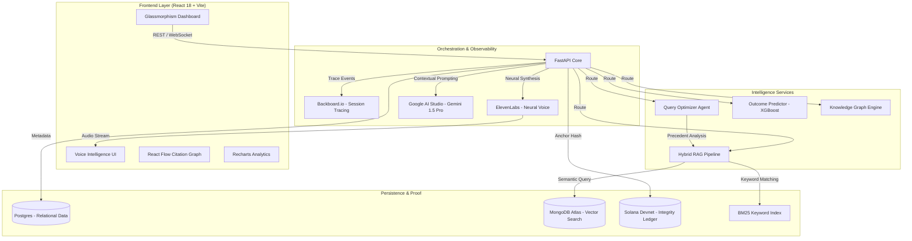
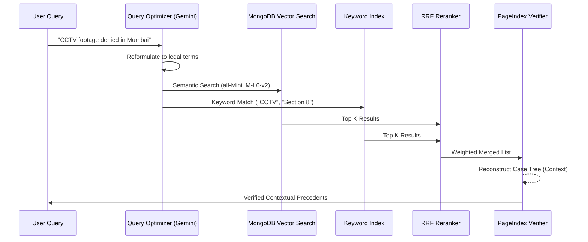
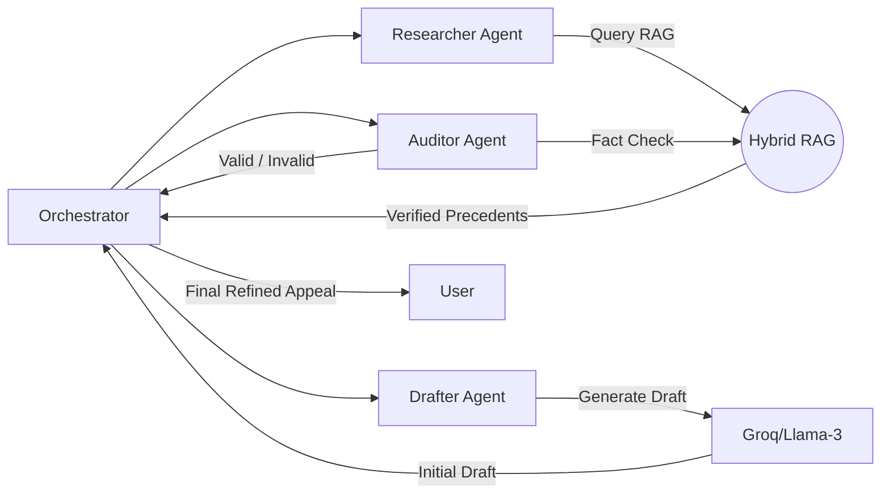
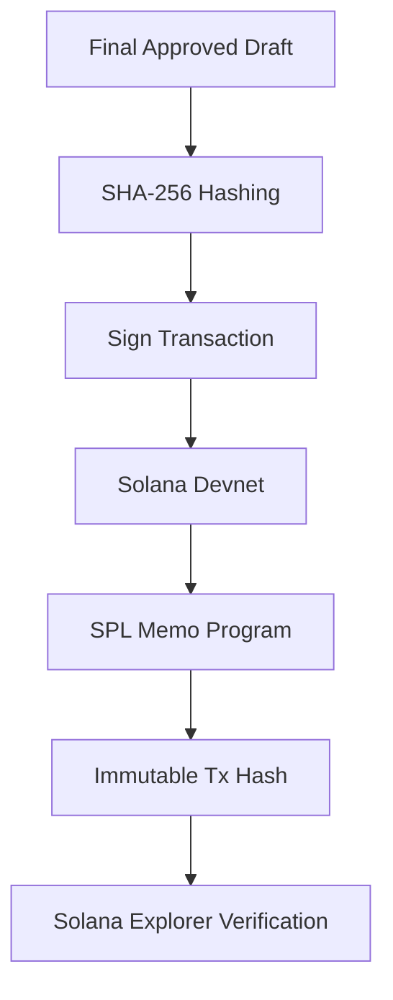

# 🔍 RTI-Lens: Enterprise AI Legal Intelligence

RTI-Lens is a state-of-the-art AI platform designed for advanced analysis of India's RTI (Right to Information) Act rulings. It leverages Large Language Models (LLMs), Machine Learning, and Blockchain technology to provide legal professionals and citizens with deep insights into CIC (Central Information Commission) orders.

---

## 🎯 The Problem

Navigating the Right to Information (RTI) landscape in India is fraught with challenges for both citizens and legal professionals:

1.  **Legal Information Overload**: The Central Information Commission (CIC) generates thousands of rulings every year. Manually synthesizing these to find a relevant precedent for an appeal is nearly impossible.
2.  **Systemic Opaqueness**: Government ministries often cite exemptions (like Section 8(1)(j) for privacy) inconsistently. Without data-driven insights, it's hard to challenge these "standard" denials.
3.  **Low Success Rates**: Many first-time RTI appeals fail because they lack the proper legal grounding or fail to cite the specific precedents that have historically overturned similar denials.
4.  **Submission Integrity**: In many cases, there is no immutable proof of what was submitted and when, leading to disputes over document tampering or "lost" applications.

## 💡 The Solution: RTI-Lens

RTI-Lens transforms the RTI process from a guessing game into a data-driven science:

*   **🧠 Agentic Appeal Drafting**: Instead of a simple prompt, RTI-Lens uses a multi-agent team (**Researcher, Drafter, and Auditor**) to synthesize a legally sound appeal that is explicitly grounded in retrieved CIC precedents.
*   **🔮 Outcome Prediction Engine**: Using an XGBoost model trained on 10,000+ historical rulings, the platform predicts the success probability of your appeal, identifying "High Risk" ministries and sections.
*   **🔗 Blockchain-Backed Integrity**: Every submission is hashed and anchored to the **Solana Devnet**. This provides a tamper-proof "Proof of Submission" that ensures the integrity of the citizen's request.
*   **🔍 Hybrid RAG Search**: Combines **MongoDB Vector Search** with **BM25 Keyword Matching** to provide the most relevant legal context, ensuring the AI drafting is always grounded in "Real Law," not hallucinations.
*   **📊 Visual Intelligence**: Interactive knowledge graphs and analytics dashboards reveal systemic denial patterns across various ministries, helping users identify the most successful path for their requests.

---

## 🏗️ System Architecture



---

## 🚀 Key Integrations & Technology Stack

- **LLM Intelligence**: **Google AI Studio (Gemini 1.5 Pro)** is used as the primary reasoning engine for complex legal document analysis and query reformulation.
- **Vector Search**: **MongoDB Atlas Vector Search** enables high-dimensional semantic retrieval of 70,000+ legal paragraphs.
- **Blockchain Integrity**: **Solana Devnet** acts as a tamper-proof ledger for RTI filings, anchoring SHA-256 document hashes via the **SPL Memo Program**.
- **Voice Synthesis**: **ElevenLabs** provides ultra-realistic neural voice synthesis for the real-time legal assistant.
- **Observability**: **Backboard.io** provides real-time workflow tracing, allowing developers to monitor the decision-making steps of the RAG agents.

---

## 🧠 In-Depth System Mechanisms

### 1. Hybrid RAG Architecture (The Retrieval Engine)

RTI-Lens uses a **Two-Stage Hybrid Retrieval** process designed to eliminate legal hallucinations and ensure 100% citation accuracy.

#### The Pipeline Flow


*   **Vector Search (MongoDB Atlas)**: Captures the "vibe" and semantic intent of the query.
*   **BM25 Keyword Matching**: Ensures specific sections (e.g., `8(1)(j)`) are never missed.
*   **PageIndex Verification**: A proprietary algorithm that ensures retrieved chunks aren't just isolated sentences but are grounded in the full hierarchy of the original ruling.

---

### 2. Multi-Agent Drafting Mechanism (The Legal Brain)

Instead of a single prompt, RTI-Lens employs an **Agentic Workflow** where multiple specialized agents collaborate to synthesize the final appeal.

#### The Collaboration Diagram


*   **Researcher**: Dissects the user's grievance and identifies the most relevant CIC rulings.
*   **Drafter**: Translates complex legal findings into a formal, persuasive appeal letter.
*   **Auditor**: Acts as a "Safety Gate," rejecting any content that isn't explicitly supported by the retrieved precedents.

---

### 3. Blockchain Proof-of-Submission (The Integrity Layer)

RTI-Lens uses the **Solana Blockchain** to provide immutable proof that an appeal was generated and submitted at a specific point in time.

#### The Anchoring Process


*   **Immutability**: Once anchored, the SHA-256 hash cannot be altered, preventing authorities from backdating or claiming "non-receipt."
*   **Privacy**: We only store the *hash* on-chain, keeping the actual sensitive RTI content private while proving its existence.

---

### 4. Core Technology Integrations

#### 🧪 Backboard.io (Observability)
Used as the **AI Flight Recorder**. Every step of the agentic loop (Researcher -> Drafter -> Auditor) is traced. This allows developers to debug the "chain of thought" and ensures full transparency for every generated document.

#### 💎 Google Gemini 1.5 Pro (The Reasoner)
Acts as the **Primary Intelligence Engine**. It handles high-level query optimization, complex legal interpretation, and the final synthesis of the RAG context into a coherent legal strategy.

#### ⚡ Groq (Inference Velocity)
Used for **Fast Agentic Iterations**. Groq powers the rapid back-and-forth between agents, allowing the drafting process to complete in seconds rather than minutes.

#### 🍃 MongoDB Atlas (Vector Backbone)
Stores 70,000+ legal embeddings. Its native vector search allows us to perform high-dimensional similarity matches without moving data between different services.

#### 🎙️ ElevenLabs (Neural Voice)
Powers the **Voice Intelligence UI**. It provides low-latency, ultra-realistic neural voice synthesis, allowing users to interact with the legal assistant through a conversational interface.

---

## 📁 Project Structure

```text
.
├── backend/                # FastAPI High-Performance Core
│   ├── blockchain/         # Solana Client & SPL Memo Integration
│   ├── routers/            # Feature-specific API (QA, Predict, Voice)
│   ├── app/services/       # RAG Orchestration & Query Optimization
│   ├── utils/              # Vector Search & Backboard Integrations
│   └── main.py             # App Entry Point
├── frontend/               # React 18 + Tailwind + Framer Motion
│   ├── src/components/     # Specialized Dashboard Modules
│   ├── src/contexts/       # Solana Wallet & Global State
│   └── src/ui/             # Glassmorphism Design System
├── data/                   # ML Models & Search Indices
└── .env                    # Secrets & API Configuration
```

---

## 🛠️ Setup & Deployment

1. **Environment Config**:
   Populate your `.env` with `GEMINI_API_KEY`, `MONGODB_URI`, `GROQ_API_KEY`, `SOLANA_PRIVATE_KEY`, and `ELEVENLABS_API_KEY`.

2. **Backend Startup**:
   ```bash
   python -m uvicorn backend.main:app --reload --port 8002
   ```

3. **Frontend Startup**:
   ```bash
   cd frontend && npm run dev
   ```

---

## 🛡️ Security & Proof of Integrity
*   **Ed25519 Signatures**: Every blockchain anchor is signed by the platform's authority key.
*   **SHA-256 Anchoring**: Only document hashes are stored on Solana.
*   **Backboard Tracing**: Every AI-generated response is traced to its source for full accountability.
