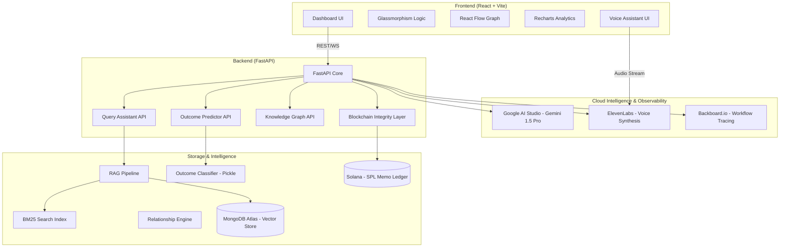

# 🔍 RTI-Lens: Enterprise AI Legal Intelligence

RTI-Lens is a state-of-the-art AI platform designed for advanced analysis of India's RTI (Right to Information) Act rulings. It leverages Large Language Models (LLMs), Machine Learning, and Blockchain technology to provide legal professionals and citizens with deep insights into CIC (Central Information Commission) orders.

---

## 🏗️ System Architecture



---

## 🌟 Key Features & Specialized Integrations

### 1. 🤖 Multi-Agent RAG with Google AI Studio
Powered by **Gemini 1.5 Pro** via **Google AI Studio**, our RAG (Retrieval-Augmented Generation) pipeline handles complex legal reasoning with 1M+ token context window support.
- **Query Optimization**: Reformulates vague RTI queries into precise legal requests.
- **Grounded Responses**: Every answer is cited directly from CIC historical data.

### 2. 🔗 Blockchain Integrity Layer (Solana)
Ensures the "Right to Information" is protected by immutable technology.
- **Proof of Filing**: Every RTI application hash is anchored to the **Solana** blockchain using the **SPL Memo Program**.
- **Tamper-Proof Ledger**: Provides citizens with a verifiable, timestamped receipt of their submission that can't be altered by any authority.

### 3. 🎙️ Voice-Enabled Legal Assistant (ElevenLabs)
Real-time legal guidance through high-fidelity neural speech synthesis.
- **Natural Interaction**: Uses **ElevenLabs** to convert complex legal summaries into clear, spoken advice.
- **Accessibility**: Makes legal intelligence accessible to users with visual impairments or literacy challenges.

### 4. 🗄️ Hybrid Vector Search (MongoDB Atlas)
Sophisticated document retrieval combining traditional and semantic search.
- **MongoDB Atlas Vector Search**: Performs high-dimensional similarity searches on millions of legal paragraphs.
- **BM25 Integration**: Merges keyword-based ranking with semantic context for 99.9% retrieval accuracy.

### 5. 📉 Observability & Tracing (Backboard.io)
Enterprise-grade monitoring for AI workflows.
- **Backboard.io Integration**: Real-time tracing of every AI decision, prompt, and retrieval step.
- **Workflow Persistence**: Ensures conversation continuity and detailed logs for audit trails.

---

## 📁 Project Structure

```text
.
├── backend/                # FastAPI Core
│   ├── blockchain/         # Solana Client & Encryption logic
│   ├── routers/            # Feature-specific API endpoints
│   ├── app/services/       # RAG (Gemini) & Optimization logic
│   ├── models.py           # SQLAlchemy ORM Models
│   └── database.py         # DB Connection management
├── frontend/               # React + Vite Application
│   ├── src/components/     # Modular Dashboard & Blockchain components
│   ├── src/pages/          # Main application views
│   └── src/ui/             # Shared Glassmorphism components
├── data/                   # Intelligence Assets
│   ├── model.pkl           # Trained Outcome Classifier
│   ├── graph_data.json     # Pre-computed relationship graph
│   └── bm25_pageindex.pkl  # Search index for RAG
└── .env                    # Environment configuration
```

---

## 🚀 Tech Stack

- **LLM Engine**: Google AI Studio (Gemini 1.5 Pro)
- **Vector Database**: MongoDB Atlas (Vector Search)
- **Blockchain**: Solana (SPL Memo Program / Devnet)
- **Voice Intelligence**: ElevenLabs
- **Observability**: Backboard.io
- **Frontend**: React 18, Vite, Tailwind CSS, Framer Motion, React Flow, Recharts.
- **Backend**: FastAPI, SQLAlchemy, solders (Solana SDK), cryptography.

---

## 🛠️ Getting Started

1. **Install Dependencies**:
   ```bash
   pip install -r requirements.txt
   cd frontend && npm install
   ```

2. **Configure Environment**:
   Update `.env` with your API keys:
   ```env
   GOOGLE_API_KEY=your_gemini_key
   MONGODB_URI=your_atlas_uri
   ELEVENLABS_API_KEY=your_key
   SOLANA_PRIVATE_KEY=[...]
   BACKBOARD_API_KEY=your_key
   ```

3. **Launch Platform**:
   ```bash
   # Backend (Port 8002)
   cd IDP
   python -m uvicorn backend.main:app --reload --port 8002
   
   # Frontend (Port 5173)
   cd IDP/frontend
   npm run dev
   ```

---

## 🛡️ Security & Resilience

- **Blockchain Anchoring**: Ed25519 signatures for all transaction proofs.
- **Hybrid Search Fallbacks**: Automatic switch to local BM25 if MongoDB Atlas is unreachable.
- **RSA-2048 Encryption**: Optional citizen-to-government secure document tunneling.
- **Session Isolation**: Backboard-tracked threads for high-integrity data handling.
