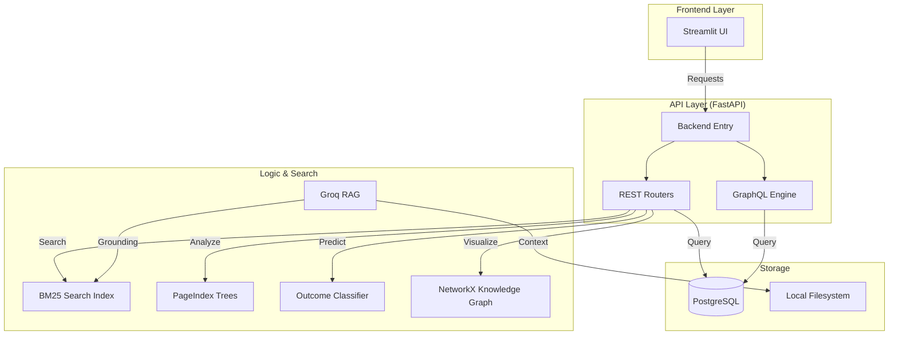

# 🔍 RTI-Lens: AI-Powered CIC Order Analytics

RTI-Lens is an advanced AI platform designed to analyze India's RTI (Right to Information) Act rulings from the Central Information Commission. It predicts appeal success, identifies denial patterns, and provides a semantic Q&A interface for over 700+ rulings.

---

## 🏗️ System Architecture



---

## 📁 Project Structure

The project is organized for modularity and scalability:

```text
.
├── bin/                    # Operational & startup scripts
│   ├── setup_data.sh       # Main data ingestion pipeline
│   ├── start_api.sh        # Launches FastAPI backend
│   └── start_frontend.sh   # Launches Streamlit UI
├── backend/                # FastAPI application core
│   ├── main.py             # App entry point & configuration
│   ├── routers/            # REST API endpoints (QA, Analytics, etc.)
│   ├── gql/                # GraphQL Schema & Resolvers
│   ├── models.py           # SQLAlchemy ORM Models
│   └── utils/              # Data loaders and search helpers
├── data/                   # Data storage (git-ignored except templates)
│   ├── cic_orders_txt/     # Raw text rulings (Input)
│   ├── cic_orders_md/      # Intermediate Markdown files
│   ├── pageindex_trees/    # Hierarchical JSON structures
│   └── *.pkl               # Serialized search & ML models
├── migrations/sql/         # Database schema and migration files
├── scripts/                # Build and maintenance scripts
├── streamlit_app.py        # Streamlit Frontend application
├── Dockerfile              # Production container definition
└── requirements.txt        # Python dependencies
```

---

## 🚀 Quick Start

### 1. Prerequisites
- **PostgreSQL 14+**
- **Python 3.11+**
- **Groq API Key** (Get one at [Groq Console](https://console.groq.com/keys))

### 2. Environment Setup
Create a `.env` file in the root directory:
```bash
cp .env.example .env
# Edit .env with your DATABASE_URL and GROQ_API_KEY
```

### 3. Initialize & Ingest
Run the unified setup script to build your local database and search indices:
```bash
./bin/setup_data.sh
```
*Note: This script handles ingestion, BM25 indexing, and building hierarchical PageIndex trees.*

### 4. Launch the Platform
Start the backend and frontend in separate terminals:

**Terminal 1 (Backend)**
```bash
./bin/start_api.sh
```

**Terminal 2 (Frontend)**
```bash
./bin/start_frontend.sh
```

---

## 🛠️ Tech Stack
- **Backend**: FastAPI, Strawberry (GraphQL), SQLAlchemy, Uvicorn
- **Frontend**: Streamlit, Requests, Pandas
- **AI/LLM**: Groq (RAG), Scikit-learn (Classifier)
- **Search**: BM25, PageIndex (Hierarchical Structure Extraction)
- **Database**: PostgreSQL

---

## 🛡️ Security
- API keys are managed via environment variables.
- Pickle files are verified with SHA-256 hashes before loading.
- Database queries use SQLAlchemy ORM to prevent SQL injection.
