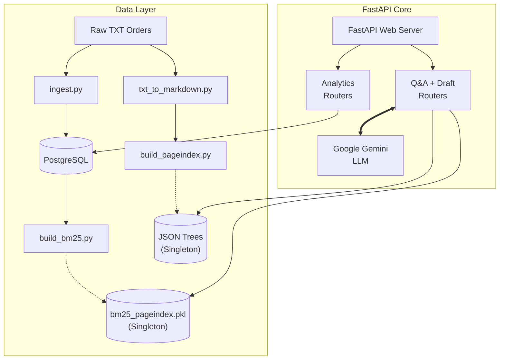

# 👁️ RTI-Lens: Intelligent CIC Order Analytics

**An AI-Powered Platform for the Central Information Commission (CIC)**

[](#)
[](#)
[](#)

---

## 📋 Table of Contents
1. [Platform Overview](#-platform-overview)
2. [What Was Built (The Stack)](#-what-was-built)
3. [Key Project Statistics](#-key-project-statistics)
4. [System Architecture](#-system-architecture)
5. [Data Pipeline Detail](#-data-pipeline-detail)
6. [API Catalog](#-api-catalog)
7. [Quick Start Guide](#-quick-start-guide)
8. [Database Schema](#-database-schema)

---

## 🎯 Platform Overview

RTI-Lens is a comprehensive platform engineered for parsing, analyzing, and interrogating India's Right to Information (RTI) Act rulings adjudicated by the Central Information Commission (CIC). By uniting **traditional Machine Learning (Random Forests)** with Next-Gen Generative AI through **Retrieval-Augmented Generation (RAG)** leveraging Google Gemini, it empowers citizens and legal experts alike to understand legal precedents instantly without reading hundreds of convoluted PDFs.

The engine can predict whether an appeal will be allowed or denied, highlight specific ministries misusing legal provisions, rapidly retrieve relevant case sections, and draft professional legal appeals automatically.

---

## 🚀 What Was Built

### 1. Robust Data Processing & ETL Pipeline
We replaced the need to manually read CIC files by converting 712 raw unformatted TXT case files into highly structured PostgreSQL representations via Python algorithms targeting Regular Expressions (`re`) and NLP (`spaCy`).

### 2. Hierarchical Retrieval Engine 
Instead of relying strictly on flat keyword search, we deployed a custom implementation of **VectifyAI's PageIndex**. We parse standard CIC text formats into markdown, extract headers recursively, and construct JSON representation trees of every single order. This allows our Q&A pipeline to isolate "Commission Findings" explicitly without confusing it with the initial "Information Sought."

### 3. Machine Learning Predictor
Trained a Scikit-Learn `RandomForestClassifier` utilizing TF-IDF embeddings concatenated with Scaled temporal identifiers. 
- Determines historical likelihood of a case being won based purely on text, section cited, and ministry.

### 4. Zero-Trust Generative Q&A 
Employs Google Gemini (`gemini-flash-lite-latest`) combined with a two-step agentic validation pass:
1. Agent answers user question leveraging context from the BM25/PageIndex pipeline.
2. The agent verifies its own response to enforce "faithfulness" back to the underlying retrieved CIC source document, virtually eliminating hallucinations.

### 5. High-Performance Server
Powered by an asynchronous **FastAPI** web framework incorporating native HTTP rate limiting (`slowapi`) preventing AI abuse via in-memory Session tracking.

---

## 📊 Key Project Statistics

| Metric | Measured Value |
|--------|-------|
| **Total Sources Processes** | 712 raw Orders |
| **Cases Normalized** | 469 mapped objects |
| **Actionable Paragraphs** | 43,151 snippets |
| **BM25 Search Index Size** | 26 MB Singleton |
| **ML Predictor Setup** | RandomForest (81.25% Acc, 0.81 F1) |
| **Python Backend Scope** | 12 optimized micro-modules |

**Noteworthy Policy Insights Found:**
- The **Ministry of Corporate Affairs** faces an ~80% appeal defeat probability historically.
- The **Ministry of Finance** holds one of the strongest defensive postures, denying with only ~30% overturn likelihood.

---

## 🏗️ System Architecture

Our Data and inference pipeline isolates expensive retrieval steps in-memory across singletons whilst delegating transactional actions directly to PostgreSQL.



---

## ⚙️ Data Pipeline Detail

If setting up the infrastructure from scratch, scripts must be run in exact order to build the artifacts properly:

1. **`scripts/ingest.py`**: Reads raw CIC formats and populates the database `cases` table.
2. **`scripts/compute_stats.py`**: Executes aggregations into `ministry_stats` and `section_stats`.
3. **`scripts/build_bm25.py`**: Maps paragraphs into an optimized search space.
4. **`scripts/train_classifier.py`**: Outputs the ML model logic as a `.pkl`.
5. **`scripts/txt_to_markdown.py` -> `scripts/build_pageindex.py`**: Builds formatting structures enabling the RAG system to comprehend sections accurately.

---

## 🔌 API Catalog

**API Base**: `http://localhost:8000`  
**Swagger Docs Built-in**: `http://localhost:8000/docs`

| Method | Route | Auth Req | Payload / Purpose |
|------|-----------|-----------|-----------|
| **GET** | `/health` | No | Heartbeat + service injection status. |
| **GET** | `/api/analytics/denial-rates` | No | Array of ministries sorted by un-responsiveness index. |
| **GET** | `/api/analytics/section-heatmap` | No | Overturned frequencies mapped against specific section citations. |
| **GET** | `/api/analytics/override-trend` | No | 2-year temporal moving average of allowed outcomes. |
| **POST**| `/api/predict` | No | `{ "ministry": "...", "section_cited": "8(1)(j)", "raw_text": "..." }` |
| **POST**| `/api/qa` | **Gemini Key** | `{ "question": "Why is 8(1)(j) normally overturned here?" }` |
| **POST**| `/api/draft` | **Gemini Key** | Extracts similar cases and writes formal Appeals citing precedent. |

---

## 🏁 Quick Start Guide

**1. Clone and Configure**
Ensure Python 3.12+ and PostgreSQL 14+ is installed.
```bash
# Add your Gemini Key
echo "GEMINI_API_KEY=AIzaSy_YOUR_KEY_HERE" >> .env
# Optional DB Config
echo "DATABASE_URL=postgresql://user@localhost:5432/rtilens" >> .env
```

**2. Provision Environment**
```bash
pip install -r requirements.txt
# Ensure PostgreSQL is actively running
brew services start postgresql@14
```

**3. Run Diagnostic Check**
```bash
chmod +x validate.sh
./validate.sh
```

**4. Start Server Operations**
```bash
./start_api.sh
# Will initialize on port 8000
```

---

## 🗄️ Database Schema

The implementation is backed by a fully normalized `Postgres` structure utilizing `TIMESTAMPTZ` and associative mapping:

- **`ministries`**: Resolves arbitrary entity naming mismatches inside source texts.
- **`cases`**: Base truth containing canonical `order_url`, `section_cited`, `appeal_outcome` and temporal tracking.
- **`paragraphs`**: Bound via Cascading Foreign Key back to the individual case; required for granular spatial vector mapping.
- **`ministry_stats` / `section_stats`**: High-performance Cached aggregates queried natively by the FastAPI analytics interfaces.
- **`blockchain_filings`**: Scoped un-implemented architecture for storing cryptographic timestamps of rulings against tamper attempts.
