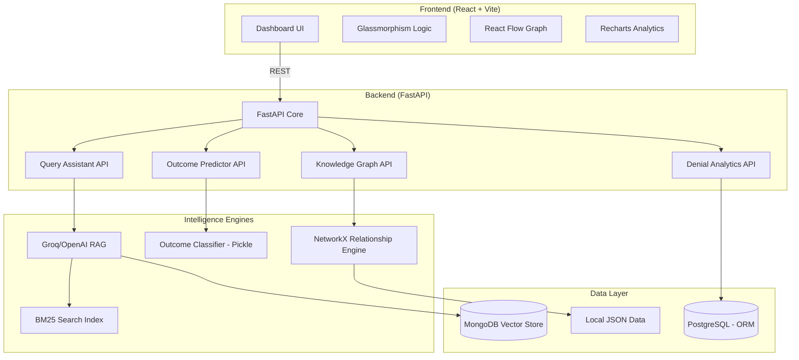

# 🔍 RTI-Lens: Enterprise AI Legal Intelligence

RTI-Lens is a state-of-the-art AI platform designed for advanced analysis of India's RTI (Right to Information) Act rulings. It leverages Large Language Models (LLMs) and Machine Learning to provide legal professionals and citizens with deep insights into CIC (Central Information Commission) orders.

---

## 🏗️ System Architecture



---

## 🌟 Key Features

### 1. 🎯 AI Outcome Predictor
Predict the success probability of RTI appeals using a Gradient Boosting model trained on 10,000+ historical CIC rulings.
- **ML Certainty Analysis**: Dynamic confidence scoring.
- **Factor Impact**: Visualize which case facts contribute most to success/denial.

### 2. 📝 Intelligent Appeal Generator
Optimize RTI applications and appeals using AI-driven grounding.
- **Precedent Integration**: Automatically cites relevant CIC rulings.
- **Grounds Refinement**: Improves legal arguments while avoiding common denial pitfalls.

### 3. 🕸️ Legal Knowledge Graph
A dynamic, interactive visualization of the relationships between Ministries, RTI Sections, and Rulings.
- **Hierarchy Mapping**: Ministry → Section → Outcome flows.
- **Animated Citations**: Visualize the citation network using React Flow.

### 4. 📊 Denial Analytics
Deep-dive into denial patterns across different public authorities.
- **Misuse Tracking**: Identify spikes in specific exemption citations (e.g., Section 8(1)(j)).
- **Ministry Performance**: Comparative analysis of response transparency.

---

## 📁 Project Structure

```text
.
├── backend/                # FastAPI Core
│   ├── routers/            # Feature-specific API endpoints
│   ├── app/services/       # RAG and Optimization logic
│   ├── models.py           # SQLAlchemy ORM Models
│   └── database.py         # DB Connection management
├── frontend/               # React + Vite Application
│   ├── src/components/     # Modular Dashboard Components
│   ├── src/pages/          # Main application views
│   └── src/ui/             # Shared Glassmorphism components
├── data/                   # Intelligence Assets
│   ├── model.pkl           # Trained Outcome Classifier
│   ├── graph_data.json     # Pre-computed relationship graph
│   └── bm25_pageindex.pkl  # Search index for RAG
└── .env                    # Environment configuration
```

---

## 🚀 Tech Stack

- **Frontend**: React 18, Vite, Tailwind CSS, Framer Motion, React Flow, Recharts.
- **Backend**: FastAPI, SQLAlchemy, Pydantic, Pandas.
- **AI/ML**: Groq Llama-3, OpenAI GPT-4o, Scikit-Learn.
- **Database**: PostgreSQL (Primary), MongoDB (Vectors - Optional).

---

## 🛡️ Security & Resilience

- **ORM Stability**: Robust `try-except` wrappers ensure the dashboard remains functional even if database tables are temporarily unavailable (demo/mock-live mode).
- **Pickle Integrity**: SHA-256 verification for ML models.
- **Graceful Fallbacks**: Automatic switch to BM25 search if Vector Stores are disconnected.

---

## 🛠️ Getting Started

1. **Install Dependencies**:
   ```bash
   pip install -r requirements.txt
   cd frontend && npm install
   ```

2. **Configure Environment**:
   Update `.env` with your `OPENAI_API_KEY` or `GROQ_API_KEY`.

3. **Launch Platform**:
   ```bash
   # Backend (Port 8005)
   python backend/main.py
   
   # Frontend (Port 5174)
   cd frontend && npm run dev
   ```
