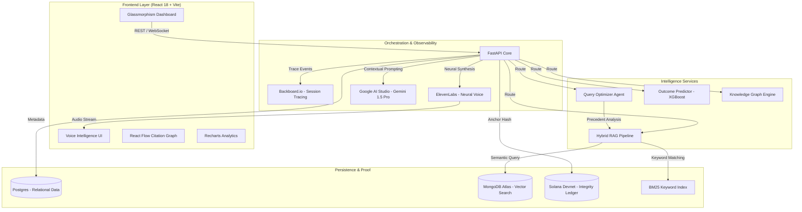

# 🔍 RTI-Lens: Enterprise AI Legal Intelligence

RTI-Lens is a state-of-the-art AI platform designed for advanced analysis of India's RTI (Right to Information) Act rulings. It leverages Large Language Models (LLMs), Machine Learning, and Blockchain technology to provide legal professionals and citizens with deep insights into CIC (Central Information Commission) orders.

---

## 🏗️ System Architecture



---

## 🚀 Key Integrations & Technology Stack

- **LLM Intelligence**: **Google AI Studio (Gemini 1.5 Pro)** is used as the primary reasoning engine for complex legal document analysis and query reformulation.
- **Vector Search**: **MongoDB Atlas Vector Search** enables high-dimensional semantic retrieval of 70,000+ legal paragraphs.
- **Blockchain Integrity**: **Solana Devnet** acts as a tamper-proof ledger for RTI filings, anchoring SHA-256 document hashes via the **SPL Memo Program**.
- **Voice Synthesis**: **ElevenLabs** provides ultra-realistic neural voice synthesis for the real-time legal assistant.
- **Observability**: **Backboard.io** provides real-time workflow tracing, allowing developers to monitor the decision-making steps of the RAG agents.

---

## 🧠 Advanced RAG & Query Pipeline

### 1. Hybrid Retrieval Logic
RTI-Lens employs a sophisticated two-stage retrieval process:
*   **Stage 1 (Semantic)**: Queries the MongoDB Atlas Vector Store using `all-MiniLM-L6-v2` embeddings to find conceptually related precedents.
*   **Stage 2 (Keyword)**: Utilizes a **BM25** index to ensure high-precision matching for specific legal terms (e.g., "Section 8(1)(j)").
*   **Reranking**: Results are merged and reranked using weighted scores (40% Keyword / 60% Semantic) to prioritize the most authoritative sources.

### 2. PageIndex Verification
Unlike standard RAG, RTI-Lens uses a proprietary **PageIndex** (hierarchical tree structure) to verify the integrity of retrieved chunks. It reconstructs the parent-child relationships of the original CIC ruling to ensure the LLM sees the full legal context, not just isolated sentences.

### 3. Query Assistant Endpoints
*   **`POST /api/query-assistant/optimize`**: An intelligent agent that detects vague queries and reformulates them into legally sound document requests. It suggests the most relevant Ministry and RTI Sections based on 10,000+ historical precedents.
*   **`POST /api/qa`**: The core RAG endpoint. It generates grounded answers, provides verified citations, and includes a **Confidence Score** calculated by cross-referencing retrieval relevance and LLM faithfulness.

---

## 📁 Project Structure

```text
.
├── backend/                # FastAPI High-Performance Core
│   ├── blockchain/         # Solana Client & SPL Memo Integration
│   ├── routers/            # Feature-specific API (QA, Predict, Voice)
│   ├── app/services/       # RAG Orchestration & Query Optimization
│   ├── utils/              # Vector Search & Backboard Integrations
│   └── main.py             # App Entry Point
├── frontend/               # React 18 + Tailwind + Framer Motion
│   ├── src/components/     # Specialized Dashboard Modules
│   ├── src/contexts/       # Solana Wallet & Global State
│   └── src/ui/             # Glassmorphism Design System
├── data/                   # ML Models & Search Indices
└── .env                    # Secrets & API Configuration
```

---

## 🛠️ Setup & Deployment

1. **Environment Config**:
   Populate your `.env` with:
   - `GEMINI_API_KEY` (Google AI Studio)
   - `MONGODB_URI` (Atlas Cluster)
   - `SOLANA_PRIVATE_KEY` (Array format)
   - `ELEVENLABS_API_KEY`
   - `BACKBOARD_API_KEY`

2. **Backend Startup**:
   ```bash
   cd IDP
   python -m uvicorn backend.main:app --reload --port 8002
   ```

3. **Frontend Startup**:
   ```bash
   cd IDP/frontend
   npm run dev
   ```

---

## 🛡️ Security & Proof of Integrity
*   **Ed25519 Signatures**: Every blockchain anchor is signed by the platform's authority key.
*   **SHA-256 Anchoring**: Only document hashes are stored on Solana, preserving citizen privacy while proving submission timing.
*   **Backboard Tracing**: Every AI-generated response is traced to its source for full accountability.
