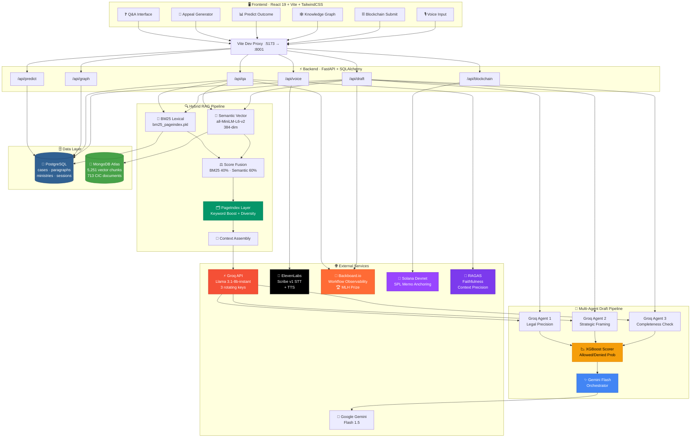
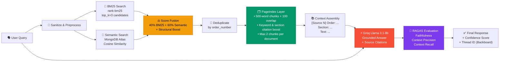
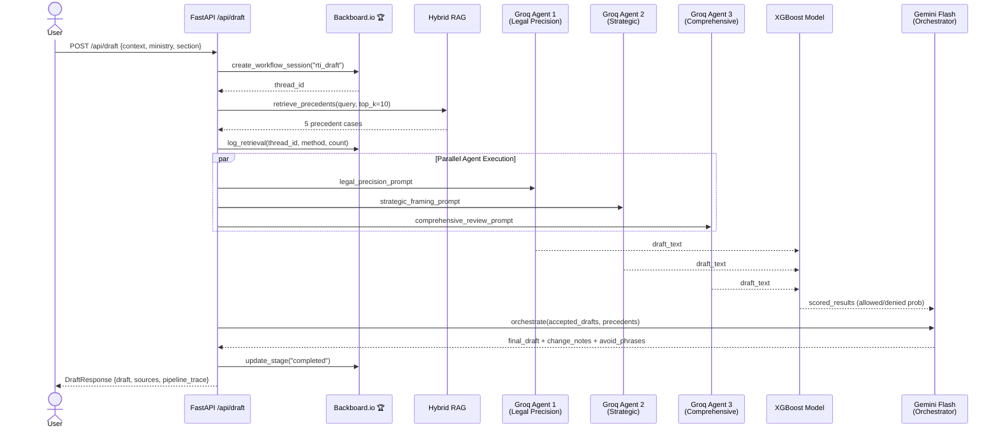

<div align="center">

<h1>
  
</h1>

<p>
  <strong>AI-Powered RTI Analytics Platform for India</strong><br/>
  <em>Hybrid RAG · Multi-Agent LLMs · Blockchain · Voice · Workflow Observability</em>
</p>

<p>
  <a href="#"></a>
</p>

<br/>

<p>
  
  
  
  
  
  
  
  
  
  
  
  
</p>

<br/>

> **RTI-Lens** is a full-stack AI platform that makes the Right to Information Act accessible to every Indian citizen —  
> with case-grounded answers, AI-drafted appeals, outcome predictions, and blockchain-verified submissions.

</div>

---

## 🏆 NMIT HACKS 2026 — MLH Track Prize Winner

<div align="center">

```
╔══════════════════════════════════════════════════════════════╗
║  🥇  WINNER — MLH Track Prize sponsored by Backboard.io    ║
║      NMIT HACKS 2026 Hackathon                              ║
║                                                              ║
║  Recognized for best production-grade integration of         ║
║  AI workflow observability in a civic-tech application.      ║
╚══════════════════════════════════════════════════════════════╝
```

</div>

RTI-Lens uses **Backboard.io** to create live-tracked workflow threads for every Q&A session and appeal draft, providing stage-by-stage audit trails across `initiated → retrieval → generation → completed`, stored in both Backboard's cloud and a local PostgreSQL audit table.

---

## 🗺️ System Architecture



---

## 🔄 Hybrid RAG Pipeline — Deep Dive



---

## 🤖 Multi-Agent Appeal Draft Pipeline



---

## 📦 Quick Start

### Prerequisites

| Tool | Version |
|------|---------|
| Python | 3.12+ |
| Node.js | 18+ |
| PostgreSQL | 14+ |
| MongoDB Atlas | Cloud cluster |

### 1. Clone & Setup

```bash
git clone https://github.com/yourorg/RTI_Lens.git
cd RTI_Lens

# Backend
python3 -m venv .venv && source .venv/bin/activate
pip install -r requirements.txt

# Frontend
cd frontend && npm install
```

### 2. Configure Environment

```bash
cp .env.example .env
# Edit .env with your credentials (see table below)
```

<details>
<summary>📋 <strong>Full Environment Variable Reference</strong></summary>

| Variable | Required | Description |
|----------|----------|-------------|
| `DATABASE_URL` | ✅ | PostgreSQL connection string |
| `MONGODB_URI` | ✅ | MongoDB Atlas connection URI |
| `GROQ_API_KEY` | ✅ | Primary Groq API key |
| `GROQ_API_KEY_1/2/3` | ✅ | Rotating keys for 3 parallel agents |
| `GEMINI_API_KEY` | ✅ | Google AI API key for orchestration |
| `ELEVENLABS_API_KEY` | ✅ | ElevenLabs STT + TTS |
| `BACKBOARD_API_KEY` | ✅ | Backboard.io workflow observability |
| `SOLANA_PRIVATE_KEY` | ⚠️ | JSON array — falls back to simulation if absent |
| `SOLANA_RPC_URL` | ⚪ | Defaults to `https://api.devnet.solana.com` |
| `BM25_WEIGHT` | ⚪ | Defaults to `0.4` |
| `SEMANTIC_WEIGHT` | ⚪ | Defaults to `0.6` |
| `EMBEDDING_MODEL` | ⚪ | Defaults to `all-MiniLM-L6-v2` |
| `GROQ_MODEL` | ⚪ | Defaults to `llama-3.1-8b-instant` |
| `GEMINI_MODEL` | ⚪ | Defaults to `gemini-1.5-flash` |

</details>

### 3. Data Ingestion (First-time)

```bash
python step1_ingest_postgres.py       # Load cases → PostgreSQL
python step2_create_markdown_mongodb.py  # Create markdown + MongoDB docs
python step3_build_pageindex.py       # Build hierarchical index trees
python step4_build_bm25.py            # Build BM25 lexical index
python step5_build_embeddings.py      # Embed all docs → MongoDB Atlas
                                      # ⏱ ~2 min · 713 docs · 5,251 chunks
```

### 4. Run

```bash
# Terminal 1 — Backend
source .venv/bin/activate
uvicorn backend.main:app --host 127.0.0.1 --port 8001

# Terminal 2 — Frontend
cd frontend && npm run dev
# → http://localhost:5173
```

---

## 🔌 API Reference

<details>
<summary>📡 <strong>All Endpoints</strong></summary>

| Method | Endpoint | Description |
|--------|----------|-------------|
| `GET` | `/health` | System health + BM25/PageIndex status |
| `POST` | `/api/qa` | Hybrid RAG Q&A with RAGAS evaluation |
| `POST` | `/api/draft` | Multi-agent appeal draft generation |
| `POST` | `/api/predict` | XGBoost outcome prediction |
| `GET` | `/api/analytics/sections` | Section-level denial statistics |
| `GET` | `/api/analytics/ministries` | Ministry-level trend data |
| `GET` | `/api/graph` | Knowledge graph nodes + edges |
| `GET` | `/api/dashboard/stats` | Summary dashboard stats |
| `POST` | `/api/blockchain/submit` | Anchor RTI document on Solana |
| `GET` | `/api/blockchain/history` | Wallet submission history |
| `POST` | `/api/voice/transcribe` | STT: ElevenLabs → Groq Whisper fallback |
| `POST` | `/api/voice/speak` | TTS via ElevenLabs Rachel voice |
| `GET` | `/api/query-assistant/suggestions` | RTI query optimization |
| `GET` | `/api/qa/source` | Full PageIndex context for order number |

</details>

---

## 📊 Corpus & Performance

<div align="center">

| Metric | Value |
|--------|-------|
| 📄 CIC Court Orders | 713 documents |
| 🧩 Vector Chunks | 5,251 (avg 7.4/doc) |
| 📐 Chunk Strategy | 500 words / 100 overlap |
| 🔢 Embedding Dimensions | 384 (all-MiniLM-L6-v2) |
| ⚡ Q&A Latency | ~2–3 seconds |
| 📝 Draft Generation | ~6–10 seconds |
| 🎯 Outcome Prediction | <100ms |
| 🎙️ Voice Transcription | ~1–2 seconds |
| ⛓️ Blockchain Anchor | ~1–2 seconds (Devnet) |
| 🔒 Rate Limit | 60 req/min per IP |
| 🔄 Session Limit | 20 Q&A calls/session |

</div>

---

## 📡 Backboard.io Integration (MLH Prize Winner 🏆)

Every user interaction creates a fully tracked workflow thread:

```
Session Created   → Backboard thread_id assigned
      │
      ▼
Stage: retrieval  → log_retrieval(query, method, num_results, top_sources)
      │
      ▼
Stage: generation → log_generation(prompt_type, response_summary, model)
      │
      ▼
Stage: completed  → update_workflow_state("completed")
```

All events are mirrored to **PostgreSQL** `workflow_sessions` and `workflow_actions` tables for local audit trails, independent of Backboard's availability.

---

## 🛡️ Security

- ✅ Input sanitization on all endpoints
- ✅ SlowAPI rate limiting (60 req/min per IP)
- ✅ Session Q&A cap (20 calls/session)
- ✅ XGBoost model loaded with SHA-256 hash verification
- ✅ Blockchain simulation fallback when private key absent
- ✅ CORS configured for local development origins

---

## 📄 License

MIT License — see [LICENSE](LICENSE) for details.

---

<div align="center">

Built with ❤️ for Indian citizens exercising their right to information.

<br/>


</div>
