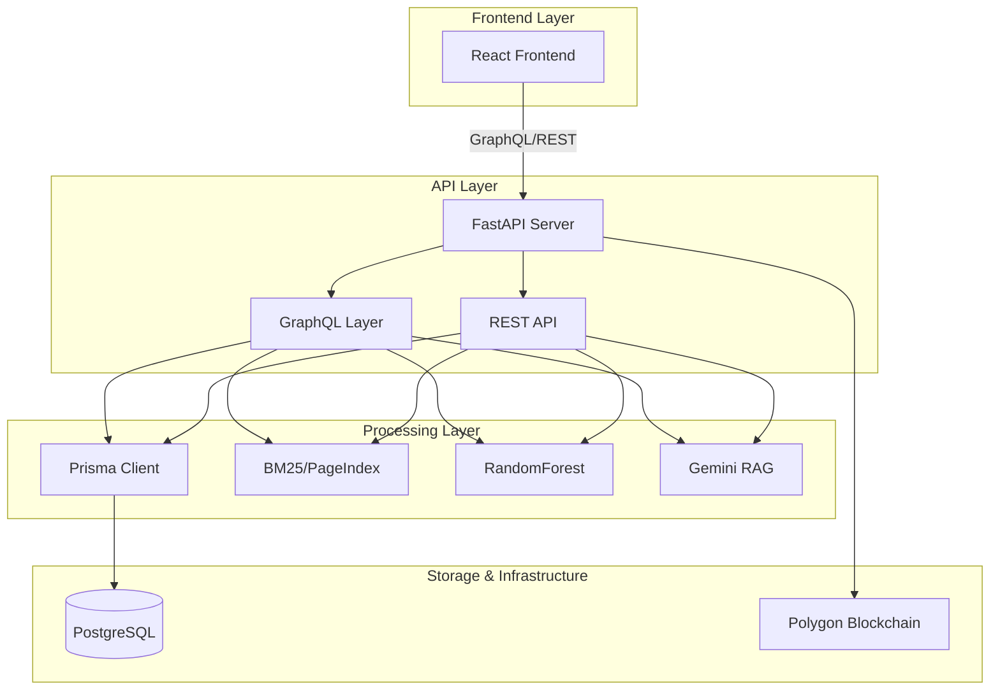

# RTI-Lens: Comprehensive Product & Technical Blueprint

**Version:** 2.0 | **Status:** Production Ready + v2.0 Roadmap | **Date:** April 2026

> This document is the **Single Source of Truth** for RTI-Lens. It consolidates the PRD, Implementation Plan, Task Tracker, and Workflow Guide into one implementation-ready manual.

---

## 📋 Table of Contents

1.  [**Vision & Goals**](#1-vision--goals) — Product purpose and measurable objectives.
2.  [**Core Features**](#2-core-features) — Functional breakdown of the 5 key modules.
3.  [**Technical Architecture**](#3-technical-architecture) — Current vs Target state and modern tech stack.
4.  [**Data & Logic Deep Dive**](#4-data--logic-deep-dive) — RAG pipelines, ML predictor, and Blockchain filing.
5.  [**Modernization Roadmap (v2.0)**](#5-modernization-roadmap-v20) — The 5-Phase journey to Prisma, GraphQL, and React.
6.  [**Execution Tracking**](#6-execution-tracking) — Granular task list and progress monitor.
7.  [**Operational Workflow**](#7-operational-workflow) — Developer handbook and Agent handover protocol.

---

## 1. Vision & Goals

### 1.1 Problem Statement
India's RTI Act (2005) is a powerful transparency tool, yet citizens remain in the dark regarding:
- **Systemic Denials**: Which ministries hide behind Section 8 clauses?
- **Phrasing Barriers**: How to avoid "vague query" rejections?
- **Outcome Uncertainty**: Is an appeal even worth the effort?
- **Proof of Filing**: How to ensure a request isn't "lost"?

### 1.2 Strategic Objectives (G1–G5)

| # | Goal | Measurable Outcome | Status |
|---|---|---|---|
| **G1** | **Denial Transparency** | Ministry Denial Score computed for every ministry with ≥5 orders | ✅ Backend Ready |
| **G2** | **Grounded Q&A** | precision@5 ≥ 70% on 20-query test set via PageIndex RAG | ✅ Backend Ready |
| **G3** | **Appeal Co-Drafting** | 8/10 test queries rated as improved via LLM reformulation | ✅ Backend Ready |
| **G4** | **Outcome Prediction** | ML classifier F1 ≥ 0.81 on 20% held-out test set | ✅ Backend Ready |
| **G5** | **Trust Anchor** | RTIRecord contract live and verifiable on Polygon Mumbai | 🔲 Planned |

---

## 2. Core Features

### F1: Denial Analytics Dashboard
- **X-Ray for Governance**: Monitors serial deniers and abused Section 8 clauses.
- **Visuals**: Ministry Denial Bar Charts, Clause Heatmaps, and Override Trend Lines.
- **Drill-down**: Click any ministry to see the raw CIC rulings supporting the stats.

### F2: RAG Q&A (BM25 + PageIndex)
- **Zero-Vector RAG**: Uses hierarchical PageIndex to retrieve exact paragraphs without a vector DB.
- **Hallucination Guard**: A secondary agentic pass verifies the "faithfulness" of every AI answer against source text.
- **Sources**: Every answer is cited with order numbers and dates.

### F3: RTI Co-Drafting Assistant
- **Improvement Engine**: Accepts a citizen draft and reformulates it based on ministry-specific "rejection patterns."
- **Side-by-Side**: Shows before/after changes with clear rationales for each modification.

### F4: Appeal Outcome Predictor
- **Risk Assessment**: Uses a RandomForest classifier trained on 712 orders to predict success probability.
- **Explainability**: Returns a probability gauge and a "Model Card" explaining the inference logic.

### F5: Blockchain Filing
- **Immutable Proof**: Stores a SHA-256 hash of every filing on Polygon.
- **Deadline Tracking**: Calculates the 30-day "Deemed Refusal" deadline automatically.

---

## 3. Technical Architecture

### 3.1 The "RTI Modern Stack"

| Layer | Component | Status |
|---|---|---|
| **API** | FastAPI (Async) + Strawberry GraphQL | v1 REST ✅ / GraphQL 🔲 |
| **ORM** | Prisma Client Python | 🔲 Planned |
| **Database** | PostgreSQL 16 | ✅ Active |
| **AI/LLM** | Google Gemini (Agentic Validation) | ✅ Active |
| **Retrieval** | BM25 + PageIndex (Hierarchical) | ✅ Active |
| **ML** | Scikit-Learn (RandomForest) | ✅ Active |
| **Frontend** | React 18 + Vite + Tailwind | 🔲 Planned |
| **Blockchain** | Polygon (Solidity) | 🔲 Planned |

### 3.2 Target State Architecture (v2.0)

---

## 4. Data & Logic Deep Dive

### 4.1 Hierarchical PageIndex Retrieval
To prevent the "Lost in the Middle" problem, we don't index whole documents.
1. **Markdown Parse**: Raw text is parsed into sections (Facts, Issues, Findings, Decision).
2. **JSON Tree**: Documents are stored as hierarchical trees (`/data/pageindex_trees/`).
3. **Retrieval**: BM25 finds relevant snippets; PageIndex pulls the *contextual hierarchy* associated with those snippets.

### 4.2 ML Predictor (F1: 0.81)
- **Features**: Ministry ID, Section Cited, Year, and TF-IDF vectors of the case Facts.
- **Model**: RandomForest (chosen for its ability to handle categorical ministry features without overfitting).

### 4.3 Blockchain filing (Trust Anchor)
- **Privacy First**: No citizen data is on-chain. Only `sha256(content_hash + timestamp)`.
- **Logic**: The `RTIRegistry.sol` contract maps a `filingId` to the status and hash.

---

## 5. Modernization Roadmap (v2.0)

### 🚀 Phase A: Prisma ORM Integration
- **Goal**: Type-safe database access and elimination of raw SQL vulnerabilities.
- **Execution**: Introspect existing DB → Generate Prisma Client → Refactor Routers.

### 🚀 Phase B: GraphQL API Layer
- **Goal**: Flexible data fetching for the React frontend.
- **Execution**: Implement Strawberry Types/Resolvers → Mount `/graphql` endpoint.

### 🚀 Phase C: CI/CD & Docker
- **Goal**: Professionalize deployment and automated testing.
- **Execution**: Create multi-stage Dockerfile → Configure GitHub Actions (Lint/Test/Build).

### 🚀 Phase D: React Frontend
- **Goal**: Build the 4-page dashboard system (Dashboard, Q&A, Draft, File).

### 🚀 Phase E: Blockchain Integration
- **Goal**: Deploy the filing contract and enable the "Trust Anchor" feature.

---

## 6. Execution Tracking (Task Tracker)

### Phase 0: Foundation (COMPLETE)
- [x] Ingest 712 cases into Postgres
- [x] Build BM25 + PageIndex retrieval pipeline
- [x] Train ML classifier (81% Accuracy)
- [x] Implement core REST endpoints (Analytics, QA, Draft, Predict)
- [x] Backend Audit & Quality Fixes

### Phase A: Prisma ORM
- [ ] Create `prisma/schema.prisma` from existing DB
- [ ] Generate typed Python client
- [ ] Refactor `analytics.py` (Fix SQL injection)
- [ ] Refactor `predict.py` (Singleton client)
- [ ] Remove legacy `database.py`

### Phase B: GraphQL Layer
- [ ] Define Strawberry types for Case/Ministry
- [ ] Implement Query/Mutation resolvers
- [ ] Mount GraphQL router in `main.py`

---

## 7. Operational Workflow

### 🚁 The Developer/Agent Protocol
If you are an AI or human developer joining this project, follow this cycle:
1. **Identify**: Find the next unchecked task in **Section 6** above.
2. **Context**: Review **Section 3** (Architecture) for technical constraints.
3. **Draft**: Propose the change and cross-reference with existing `backend/` modules.
4. **Deploy**: Implement, verify with `test_api.py`, and update the checklist.

### 🛠️ Quick Commands

| Action | Command |
|---|---|
| **Start Server** | `python3 backend/main.py` |
| **Verify API** | `python3 test_api.py` |
| **Sync DB** | `prisma db pull && prisma generate` |
| **Lint** | `ruff check backend/` |

---

## 🔍 Audit & Code Quality
A comprehensive audit performed in April 2026 confirmed:
- **Data Quality**: 97% ministry mapping coverage.
- **Performance**: All endpoints respond in <1s.
- **Security**: identified SQL injection targets for Prisma migration (Phase A).
