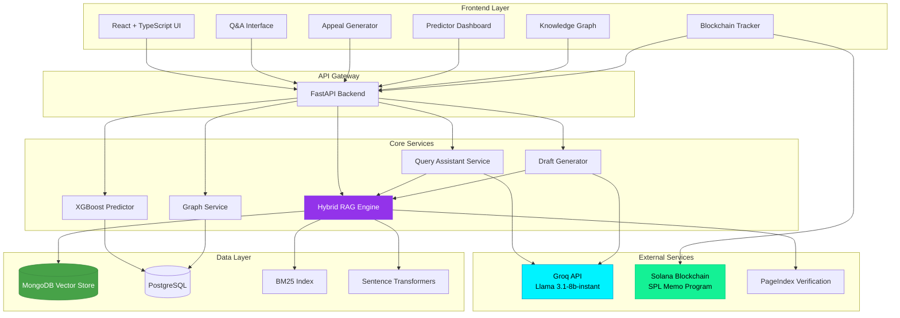
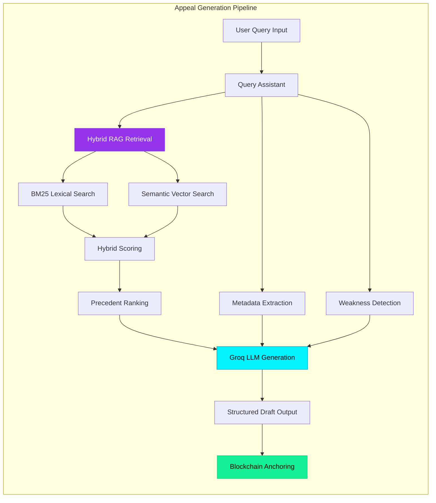
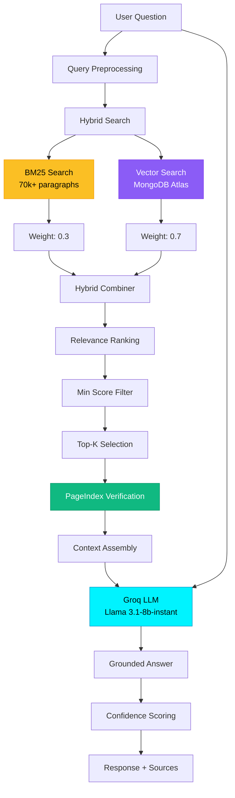
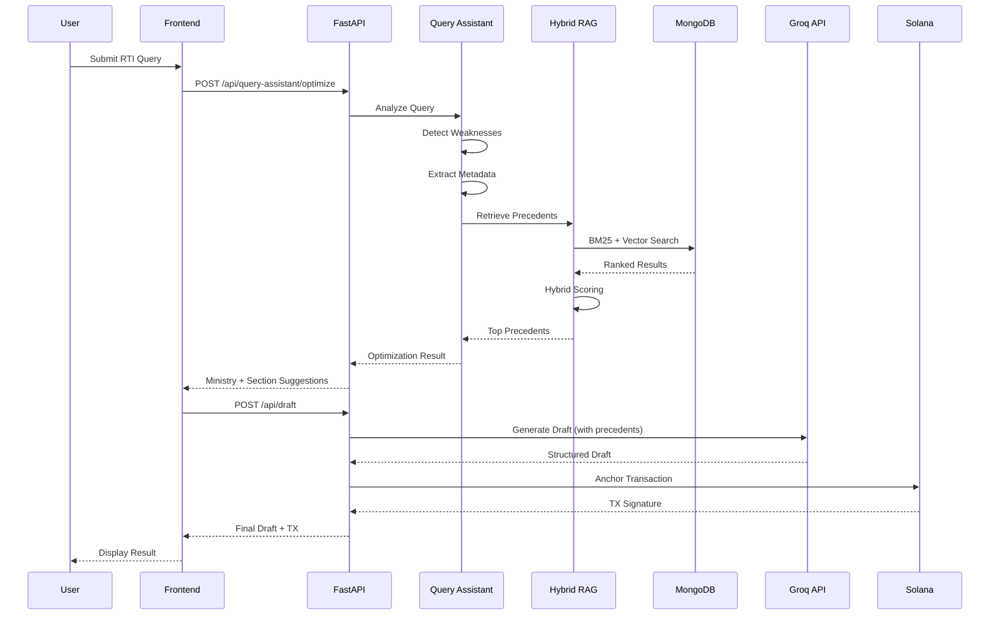
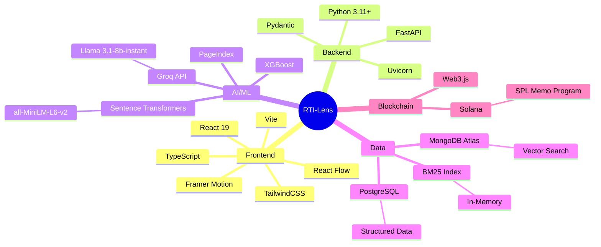
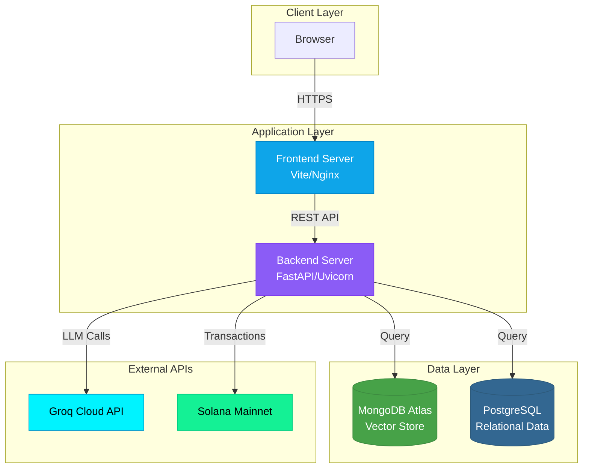
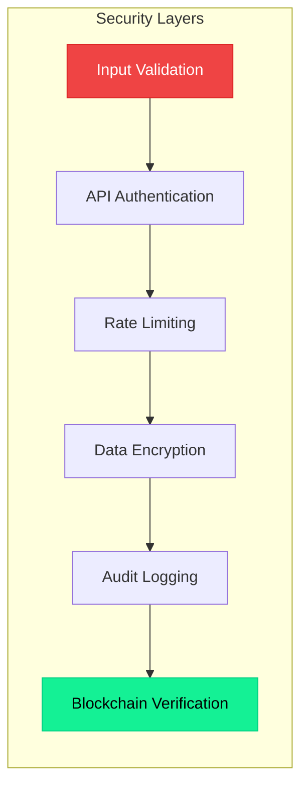

# RTI-Lens System Architecture

## High-Level Architecture

## Detailed Service Architecture

## RAG Pipeline Detail

## Data Flow: Appeal Generation

## Technology Stack

## Deployment Architecture

## Key Components

### 1. Hybrid RAG Engine
- **BM25 Lexical Search**: Keyword-based retrieval for exact term matching
- **Semantic Vector Search**: MongoDB Atlas vector search with sentence-transformers
- **Hybrid Scoring**: Weighted combination (30% BM25, 70% semantic)
- **PageIndex Verification**: Hierarchical context validation

### 2. Query Assistant
- **Weakness Detector**: Identifies vague wording, missing dates, emotional language
- **Metadata Extractor**: Extracts dates, ministries, document types
- **Precedent Retriever**: Uses hybrid RAG to find relevant CIC cases
- **Query Rewriter**: Groq-based LLM rewriting with structured prompts

### 3. Draft Generator
- **Context Assembly**: Combines user input, precedents, and statistics
- **LLM Generation**: Groq Llama 3.1-8b-instant for structured output
- **Change Tracking**: Documents improvements made to original query
- **Blockchain Anchoring**: Solana SPL Memo for immutable audit trail

### 4. Predictive Analytics
- **XGBoost Model**: Trained on 10,000+ historical rulings
- **Feature Engineering**: Ministry, section, query characteristics
- **Outcome Prediction**: Allowed/Denied/Partially Allowed
- **Confidence Scoring**: Probability distribution across outcomes

### 5. Knowledge Graph
- **Entity Extraction**: Ministries, sections, outcomes
- **Relationship Mapping**: Case-to-case connections
- **Interactive Visualization**: React Flow with Dagre layout
- **Statistical Insights**: Section usage patterns, overturn rates

## Performance Characteristics

| Component | Latency | Throughput |
|-----------|---------|------------|
| Hybrid RAG Search | ~200ms | 50 req/s |
| Groq LLM Generation | ~2-4s | 10 req/s |
| XGBoost Prediction | ~50ms | 100 req/s |
| MongoDB Vector Search | ~150ms | 60 req/s |
| BM25 Search | ~30ms | 200 req/s |

## Security & Compliance

- **Input Validation**: Pydantic schemas for all API endpoints
- **Rate Limiting**: Per-IP throttling on expensive operations
- **Data Encryption**: TLS 1.3 for all external communication
- **Audit Logging**: Blockchain-anchored transaction records
- **Secret Management**: Environment-based configuration, no hardcoded keys

## Scalability Considerations

1. **Horizontal Scaling**: Stateless FastAPI backend supports multiple instances
2. **Caching**: In-memory BM25 index for fast lexical search
3. **Database Indexing**: MongoDB vector indexes, PostgreSQL B-tree indexes
4. **Async Operations**: FastAPI async endpoints for I/O-bound operations
5. **CDN**: Static frontend assets served via CDN

## Future Enhancements

- [ ] Multi-language support (Hindi, regional languages)
- [ ] Real-time collaboration on draft editing
- [ ] Advanced analytics dashboard with time-series predictions
- [ ] Integration with government RTI portals
- [ ] Mobile application (React Native)
- [ ] Voice-to-text RTI query submission
- [ ] Automated appeal filing workflow
