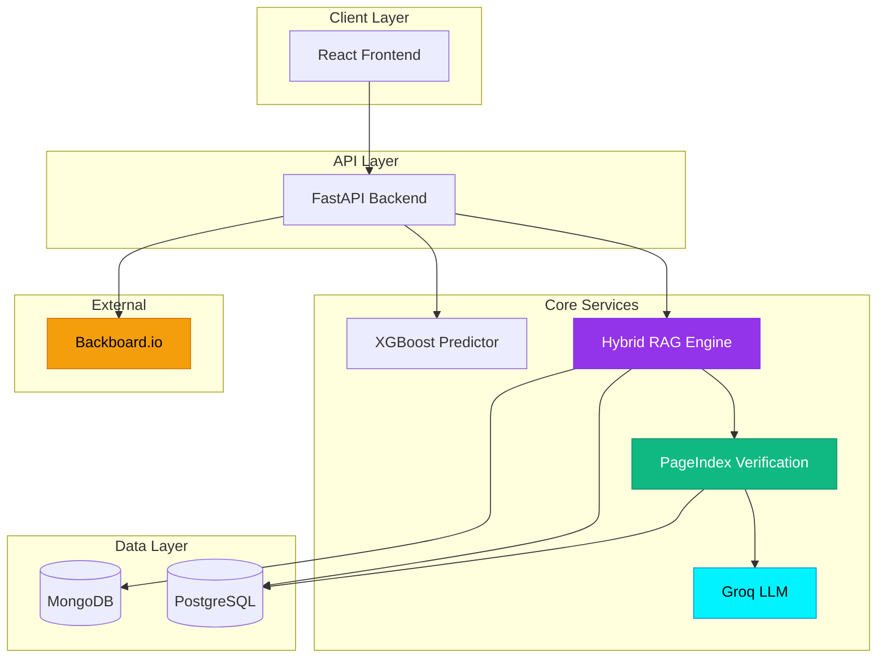

# RTI-Lens Documentation

Complete documentation for the RTI-Lens AI-powered RTI analytics platform.

---

## 📚 Documentation Index

### Getting Started
- **[Main README](../README.md)** - Project overview, features, and quick start
- **[IDP README](../README.md)** - Detailed feature descriptions and tech stack
- **[Quick Start Guide](#quick-start)** - Get up and running in 10 minutes

### Architecture & Design
- **[Architecture Documentation](./ARCHITECTURE.md)** - System architecture with Mermaid diagrams
  - High-level system overview
  - Detailed service architecture
  - RAG pipeline details
  - Data flow diagrams
  - Technology stack
  - Deployment architecture
  - Performance characteristics

### API Reference
- **[API Documentation](./API.md)** - Complete REST API reference
  - Query Assistant endpoints
  - Draft Generation endpoints
  - Q&A System endpoints
  - Prediction endpoints
  - Analytics endpoints
  - Knowledge Graph endpoints
  - Blockchain endpoints
  - Voice Interface endpoints
  - Error handling
  - SDK examples

### Deployment & Operations
- **[Deployment Guide](./DEPLOYMENT.md)** - Production deployment instructions
  - Prerequisites and system requirements
  - Development setup
  - Database configuration
  - Environment variables
  - Production deployment
  - Docker deployment
  - Monitoring and observability
  - Troubleshooting
  - Backup and recovery

### Feature Documentation
- **[RTI Query Assistant](./RTI_QUERY_ASSISTANT.md)** - Query optimization system
  - Weakness detection
  - Metadata extraction
  - Precedent retrieval
  - Query rewriting

### Data & Configuration
- **[Data Directory](../data/README.md)** - Data structure and setup
- **[Test Inputs](../test_inputs.md)** - Example queries for testing
- **[Security Policy](../SECURITY.md)** - Security guidelines and reporting

### Development
- **[CLAUDE.md](../CLAUDE.md)** - AI coding guidelines
- **[Frontend README](../frontend/README.md)** - Frontend-specific documentation
- **[PageIndex Library](../pageindex_lib/README.md)** - PageIndex library documentation

---

## Quick Start

### 1. Prerequisites

```bash
# Check versions
python --version  # 3.10+
node --version    # 18+
psql --version    # 14+
mongosh --version # 6+
```

### 2. Clone and Setup

```bash
git clone <repository-url>
cd IDP

# Backend
cd backend
python3 -m venv venv
source venv/bin/activate
pip install -r requirements.txt

# Frontend
cd ../frontend
npm install
```

### 3. Configure Environment

```bash
# Backend
cp backend/.env.example backend/.env
# Edit backend/.env with your API keys

# Frontend
cp frontend/.env.example frontend/.env
```

### 4. Setup Databases

```bash
# PostgreSQL
createdb rti_lens
psql rti_lens < backend/schema.sql

# MongoDB (or use MongoDB Atlas)
mongosh
use rti_lens
```

### 5. Ingest Data

```bash
cd backend
python scripts/ingest_orders.py
python scripts/build_bm25_index.py
python scripts/generate_pageindex.py
```

### 6. Run Application

```bash
# Terminal 1: Backend
cd backend
uvicorn main:app --reload

# Terminal 2: Frontend
cd frontend
npm run dev
```

**Access:** http://localhost:5173

---

## Architecture Overview



See [Architecture Documentation](./ARCHITECTURE.md) for detailed diagrams.

---

## Key Features

### 1. Hybrid RAG Pipeline
- **BM25 Lexical Search** (30% weight) - Keyword-based retrieval
- **Semantic Vector Search** (70% weight) - MongoDB Atlas with sentence-transformers
- **PageIndex Verification** - Hierarchical context validation
- **Groq LLM Generation** - Llama 3.1-8b-instant for fast inference

### 2. AI-Powered Appeal Drafting
- Analyzes query weaknesses (vague wording, missing dates, emotional language)
- Suggests improvements based on successful precedents
- Provides section-specific statistics and overturn rates
- Generates structured drafts with change tracking

### 3. Predictive Analytics
- XGBoost model trained on 10,000+ historical rulings
- Predicts outcomes: Allowed, Denied, Partially Allowed
- Ministry-specific misuse detection
- Confidence scoring and feature importance

### 4. Knowledge Graph
- Interactive visualization of case relationships
- Ministry-section relationship mapping
- Case clustering by outcome
- Statistical insights and patterns

### 5. Blockchain Verification
- Solana SPL Memo program integration
- SHA-256 document hashing
- Immutable proof of filing
- Transaction history tracking

### 6. Voice Interface
- ElevenLabs speech-to-text
- Groq Whisper fallback
- Text-to-speech for accessibility

---

## Technology Stack

### Backend
- **FastAPI** - High-performance async API framework
- **PostgreSQL** - Relational database for structured data
- **MongoDB Atlas** - Vector store for semantic search
- **Groq API** - LLM inference (Llama 3.1-8b-instant)
- **sentence-transformers** - Embedding generation (all-MiniLM-L6-v2)
- **rank-bm25** - Lexical search
- **XGBoost** - Outcome prediction
- **Solana.py** - Blockchain integration
- **Backboard SDK** - Workflow observability

### Frontend
- **React 19** - UI framework
- **Vite** - Build tool
- **TailwindCSS** - Styling
- **shadcn/ui** - Component library
- **@xyflow/react** - Graph visualization
- **recharts** - Analytics charts
- **Framer Motion** - Animations
- **@solana/wallet-adapter** - Blockchain integration

### ML/AI
- **Groq Llama 3.1-8b-instant** - Fast LLM inference
- **sentence-transformers** - Semantic embeddings
- **XGBoost** - Classification model
- **spaCy** - NLP preprocessing
- **PageIndex** - Hierarchical document retrieval

---

## API Endpoints

### Core Endpoints

| Endpoint | Method | Description |
|----------|--------|-------------|
| `/api/query-assistant/optimize` | POST | Optimize RTI query |
| `/api/draft` | POST | Generate appeal draft |
| `/api/qa` | POST | Ask questions about RTI law |
| `/api/predict` | POST | Predict appeal outcome |
| `/api/analytics/dashboard` | GET | Get dashboard statistics |
| `/api/graph` | GET | Get knowledge graph data |
| `/api/blockchain/anchor` | POST | Anchor document on blockchain |
| `/api/voice/transcribe` | POST | Transcribe audio to text |

See [API Documentation](./API.md) for complete reference.

---

## Development Workflow

### 1. Feature Development

```bash
# Create feature branch
git checkout -b feature/your-feature

# Make changes
# Test locally
npm run dev  # Frontend
uvicorn main:app --reload  # Backend

# Run tests
pytest  # Backend
npm test  # Frontend

# Commit and push
git add .
git commit -m "feat: your feature description"
git push origin feature/your-feature
```

### 2. Code Quality

```bash
# Backend linting
cd backend
black .
flake8 .
mypy .

# Frontend linting
cd frontend
npm run lint
npm run type-check
```

### 3. Testing

```bash
# Backend tests
cd backend
pytest tests/ -v --cov

# Frontend tests
cd frontend
npm test
npm run test:e2e
```

---

## Deployment Options

### Option 1: Docker Compose (Recommended)

```bash
docker-compose up -d
```

### Option 2: Manual Deployment

See [Deployment Guide](./DEPLOYMENT.md) for detailed instructions.

### Option 3: Cloud Platforms

- **AWS**: EC2 + RDS + DocumentDB
- **Google Cloud**: Compute Engine + Cloud SQL + MongoDB Atlas
- **Azure**: VM + PostgreSQL + Cosmos DB
- **Heroku**: Web dyno + Heroku Postgres + MongoDB Atlas

---

## Monitoring & Observability

### Application Metrics

**Backboard.io Integration:**
- RAG retrieval latency
- LLM generation time
- End-to-end request duration
- Error rates and types

**Access Dashboard:** https://backboard.io/dashboard

### Health Checks

```bash
# Backend health
curl http://localhost:8000/health

# Database health
psql -U rti_user -d rti_lens -c "SELECT 1;"
mongosh --eval "db.adminCommand('ping')"
```

### Logs

```bash
# Backend logs
sudo journalctl -u rti-backend -f

# Frontend logs (Nginx)
sudo tail -f /var/log/nginx/access.log
```

---

## Performance Benchmarks

| Operation | Latency | Throughput |
|-----------|---------|------------|
| Hybrid RAG Search | ~200ms | 50 req/s |
| Groq LLM Generation | ~2-4s | 10 req/s |
| XGBoost Prediction | ~50ms | 100 req/s |
| MongoDB Vector Search | ~150ms | 60 req/s |
| BM25 Search | ~30ms | 200 req/s |

---

## Troubleshooting

### Common Issues

**Database Connection Error:**
```bash
# Check PostgreSQL
sudo systemctl status postgresql
psql -U rti_user -d rti_lens -c "SELECT 1;"
```

**Groq API Rate Limit:**
- Implement request queuing
- Upgrade Groq plan
- Add caching layer

**MongoDB Vector Search Not Working:**
```bash
# Verify vector index
mongosh
use rti_lens
db.embeddings.getIndexes()
```

See [Deployment Guide - Troubleshooting](./DEPLOYMENT.md#troubleshooting) for more.

---

## Contributing

### Guidelines

1. **Code Style**
   - Follow existing patterns
   - Use type hints (Python) and TypeScript
   - Write descriptive commit messages

2. **Testing**
   - Add tests for new features
   - Maintain >80% code coverage
   - Test edge cases

3. **Documentation**
   - Update relevant docs
   - Add API documentation for new endpoints
   - Include code examples

4. **Pull Requests**
   - Clear description of changes
   - Link related issues
   - Pass all CI checks

---

## Security

### Reporting Vulnerabilities

See [SECURITY.md](../SECURITY.md) for security policy and reporting instructions.

### Best Practices

- Never commit API keys or secrets
- Use environment variables for configuration
- Enable SSL/TLS in production
- Implement rate limiting
- Regular security updates
- Monitor logs for suspicious activity

---

## Roadmap

### Planned Features

- [ ] Multi-language support (Hindi, regional languages)
- [ ] Real-time collaboration on drafts
- [ ] Advanced analytics dashboard
- [ ] Integration with government RTI portals
- [ ] Mobile application (React Native)
- [ ] Automated appeal filing workflow
- [ ] Redis caching layer
- [ ] GraphQL API option

---

## Support & Community

### Getting Help

- **Documentation**: Start here!
- **GitHub Issues**: Bug reports and feature requests
- **Discussions**: Questions and community support
- **Email**: support@rti-lens.example.com

### Resources

- **Website**: https://rti-lens.example.com
- **Blog**: https://blog.rti-lens.example.com
- **Twitter**: @RTILens
- **Discord**: [Community Server]

---

## License

[License information]

---

## Acknowledgments

- **CIC Orders**: Data sourced from https://cic.gov.in/
- **Groq**: Fast LLM inference
- **MongoDB Atlas**: Vector search capabilities
- **Solana**: Blockchain infrastructure
- **Open Source Libraries**: See package.json and requirements.txt

---

## Changelog

### v1.0.0 (Current)
- Initial release
- Hybrid RAG pipeline
- AI-powered appeal drafting
- Predictive analytics
- Knowledge graph visualization
- Blockchain verification
- Voice interface

---

**Last Updated:** May 10, 2024
