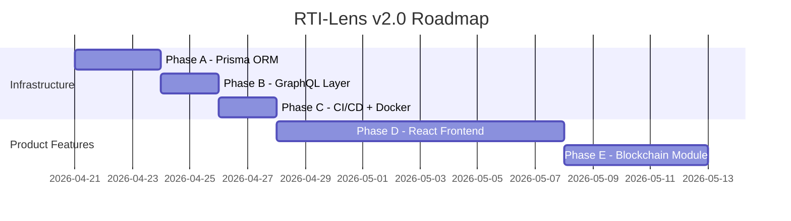

# RTI-Lens v2: Implementation Plan

📚 **TECHNICAL DOCUMENTATION**
- **Type**: Architecture & Implementation Plan
- **Audience**: Backend engineers, DevOps, project evaluators
- **Level**: Intermediate to Advanced

━━━━━━━━━━━━━━━━━━━━━━━━━━━━━━━━━━━━━━━━━━

## Table of Contents

1. [Product Context](#1-product-context)
2. [What Has Been Built (v1.0)](#2-what-has-been-built-v10)
3. [What Remains (v2.0 Roadmap)](#3-what-remains-v20-roadmap)
4. [Architecture: Current → Target](#4-architecture-current--target)
5. [Phase A: Prisma ORM Migration](#phase-a-prisma-orm-migration)
6. [Phase B: GraphQL API Layer](#phase-b-graphql-api-layer)
7. [Phase C: CI/CD & Docker](#phase-c-cicd--docker)
8. [Phase D: React Frontend](#phase-d-react-frontend)
9. [Phase E: Blockchain Integration](#phase-e-blockchain-integration)
10. [Design Decisions](#10-design-decisions)
11. [Risk Assessment](#11-risk-assessment)
12. [Troubleshooting](#12-troubleshooting)

---

## 1. Product Context

RTI-Lens is a platform for parsing, analyzing, and querying India's CIC (Central Information Commission) orders. It solves four citizen problems:

| Problem | Solution | Feature |
|---------|----------|---------|
| "Which ministries deny RTI requests?" | Pre-computed denial/override statistics | **Denial Analytics Dashboard** |
| "What do past orders say about my case?" | BM25 + PageIndex hierarchical retrieval + Gemini RAG | **Q&A Interface** |
| "How do I write a stronger RTI appeal?" | LLM reformulation with CIC precedent citations | **Co-Drafting Assistant** |
| "Will my appeal succeed?" | RandomForest classifier on CIC order corpus | **Appeal Outcome Predictor** |
| "Can I prove I filed on time?" | Blockchain SHA-256 hash on Polygon testnet | **Blockchain Filing** (planned) |

> **PRD Reference**: [RTI_Lens_PRD.md](file:///Users/mohitsahoo/Desktop/IDP/RTI_Lens_PRD.md) — Goals G1–G5

---

## 2. What Has Been Built (v1.0)

The following components are **production-ready** and operational:

### ✅ Data Pipeline (PRD Phases 1–3 — Complete)

| Script | Purpose | Output |
|--------|---------|--------|
| `scripts/ingest.py` | Parse 712 raw TXT orders → PostgreSQL | 469 cases, 43,151 paragraphs |
| `scripts/compute_stats.py` | Aggregate denial/override rates | `ministry_stats`, `section_stats` tables |
| `scripts/build_bm25.py` | Build BM25 search index over paragraphs | `data/bm25_pageindex.pkl` (26 MB) |
| `scripts/txt_to_markdown.py` | Convert TXT → structured Markdown | `data/cic_orders_md/*.md` |
| `scripts/build_pageindex.py` | Build hierarchical JSON trees from Markdown | `data/pageindex_trees/*.json` |
| `scripts/build_order_mapping.py` | Map order numbers → file hashes | `data/order_number_mapping.json` |
| `scripts/train_classifier.py` | Train RandomForest classifier | `data/model.pkl` (81.25% accuracy, 0.81 F1) |
| `scripts/build_knowledge_graph.py` | Build ministry → section → outcome graph | `data/knowledge_graph.json` |

### ✅ Backend API (PRD Phases 2–4 — Complete)

| Endpoint | Method | Feature | Status |
|----------|--------|---------|--------|
| `/health` | GET | System check | ✅ Working |
| `/api/analytics/denial-rates` | GET | Denial Dashboard | ✅ Working |
| `/api/analytics/section-heatmap` | GET | Section misuse rates | ✅ Working |
| `/api/analytics/override-trend` | GET | Override trend over time | ✅ Working |
| `/api/analytics/ministry/{id}/orders` | GET | Drill-down orders list | ✅ Working |
| `/api/qa` | POST | RAG Q&A (BM25 + PageIndex + Gemini) | ✅ Working |
| `/api/draft` | POST | Co-Drafting Assistant | ✅ Working |
| `/api/predict` | POST | Appeal Outcome Predictor | ✅ Working |
| `/api/graph` | GET | Knowledge graph data | ✅ Working |

### ❌ Not Yet Built

| Component | PRD Phase | Status |
|-----------|-----------|--------|
| React Frontend (4 pages: Dashboard, Q&A, Co-Drafter, File & Verify) | Phase 6 | Not started |
| Blockchain RTI Filing (Solidity contract + web3.py) | Phase 5 | Not started |
| `/api/blockchain/file` and `/api/blockchain/status/{tx_hash}` endpoints | Phase 5 | Not started |
| Prisma ORM (replacing raw SQL) | Enhancement | Not started |
| GraphQL API layer | Enhancement | Not started |
| CI/CD pipeline | Enhancement | Not started |
| Automated test suite (pytest) | Enhancement | Not started |

---

## 3. What Remains (v2.0 Roadmap)

v2.0 combines PRD gaps with infrastructure modernization in a single cohesive upgrade:



---

## 4. Architecture: Current → Target

### Current State (v1.0)

```
┌──────────────────────────────────────────────────────────────────────┐
│                        FastAPI Application                            │
│                                                                      │
│  REST API (/api/*)                                                   │
│  ┌────────────┐ ┌────────┐ ┌────────┐ ┌─────────┐ ┌──────┐         │
│  │ analytics  │ │  qa    │ │ draft  │ │ predict │ │graph │         │
│  │ (raw SQL)  │ │(BM25+  │ │(raw    │ │(raw SQL │ │(JSON)│         │
│  │            │ │PageIdx)│ │SQL+LLM)│ │+sklearn)│ │      │         │
│  └─────┬──────┘ └───┬────┘ └───┬────┘ └───┬─────┘ └──────┘         │
│        │            │          │           │                         │
│        ▼            ▼          ▼           ▼                         │
│  ┌─────────────────────────────────────────────────────────┐        │
│  │           SQLAlchemy text() + raw SQL strings           │        │
│  │           ⚠ f-string injection in LIMIT/OFFSET          │        │
│  └───────────────────────┬─────────────────────────────────┘        │
│                          ▼                                           │
│  ┌──────────┐   ┌──────────────┐   ┌───────────────┐               │
│  │ BM25 idx │   │ PostgreSQL   │   │ PageIndex     │               │
│  │ (pickle) │   │ (rtilens)    │   │ (JSON trees)  │               │
│  └──────────┘   └──────────────┘   └───────────────┘               │
│                                                                      │
│  ❌ No Frontend  ❌ No Blockchain  ❌ No CI/CD  ❌ No Tests          │
└──────────────────────────────────────────────────────────────────────┘
```

### Target State (v2.0)

```
┌────────────────────────────────────────────────────────────────────────────┐
│                    React Frontend (Vite + Tailwind)                        │
│  ┌────────────┐ ┌──────────┐ ┌────────────────┐ ┌──────────────────┐     │
│  │ Dashboard  │ │  Q&A     │ │  Co-Drafter +  │ │ File & Verify   │     │
│  │ (Recharts) │ │ (RAG UI) │ │  Predictor     │ │ (Blockchain)    │     │
│  └─────┬──────┘ └────┬─────┘ └───────┬────────┘ └────────┬────────┘     │
│        └──────────────┴───────────────┴───────────────────┘               │
│                            │ HTTP / GraphQL                               │
└────────────────────────────┼──────────────────────────────────────────────┘
                             ▼
┌────────────────────────────────────────────────────────────────────────────┐
│                        FastAPI Application                                 │
│                                                                            │
│  ┌─────────────────────────────────┐  ┌────────────────────────────────┐  │
│  │       REST API (/api/*)          │  │     GraphQL API (/graphql)     │  │
│  │  analytics│qa│draft│predict│graph│  │  Strawberry Queries+Mutations  │  │
│  └──────────────┬───────────────────┘  └──────────────┬─────────────────┘  │
│                 └────────────┬────────────────────────┘                    │
│                              ▼                                             │
│  ┌──────────────────────────────────────────────────────────────────────┐  │
│  │                      Data Access Layer                               │  │
│  │  ┌──────────────┐  ┌──────────────┐  ┌──────────────┐  ┌─────────┐ │  │
│  │  │ Prisma Client│  │ BM25 Loader  │  │ PageIndex    │  │ web3.py │ │  │
│  │  │ (async,typed)│  │ (pickle)     │  │ (JSON trees) │  │(Polygon)│ │  │
│  │  └──────┬───────┘  └──────────────┘  └──────────────┘  └─────────┘ │  │
│  └─────────┼───────────────────────────────────────────────────────────┘  │
│            ▼                                                              │
│  ┌──────────────────┐                                                     │
│  │   PostgreSQL      │                                                     │
│  └──────────────────┘                                                     │
└────────────────────────────────────────────────────────────────────────────┘

┌─────────────────────────────────────────────────────────────────────┐
│                     GitHub Actions CI Pipeline                       │
│  ┌────────┐    ┌──────────────┐    ┌──────────────────────┐         │
│  │  Lint  │───▶│  Unit Tests  │───▶│  Docker Build Check  │         │
│  │ (ruff) │    │  (pytest)    │    │  (docker build)      │         │
│  └────────┘    └──────────────┘    └──────────────────────┘         │
└─────────────────────────────────────────────────────────────────────┘
```

---

## Phase A: Prisma ORM Migration

**Goal**: Replace all raw SQL `text()` queries with typed Prisma Client calls. Fix the SQL injection vulnerability.

### What Changes

| File | Action | Current Problem | Prisma Solution |
|------|--------|----------------|-----------------|
| `prisma/schema.prisma` | **NEW** | No ORM models | Declarative schema mapped to existing tables via `@@map()` |
| `backend/prisma_client.py` | **NEW** | — | Async singleton, connected in lifespan |
| `backend/routers/analytics.py` | **MODIFY** | 4 raw SQL queries, f-string injection on L173 | `db.ministrystats.find_many()`, `db.case.find_many(skip=, take=)` |
| `backend/routers/draft.py` | **MODIFY** | 1 raw SQL query + `Depends(get_db)` | `db.sectionstats.find_first(where=..., include=...)` |
| `backend/routers/predict.py` | **MODIFY** | Creates new SQLAlchemy engine per request (L71-79) | `db.case.count(where=...)` |
| `backend/main.py` | **MODIFY** | — | Add `connect_db()`/`disconnect_db()` to lifespan |
| `backend/database.py` | **DELETE** | Entire SQLAlchemy layer | Replaced by Prisma |

### Migration Approach

```bash
# No data migration needed — introspect existing live DB
prisma db pull      # Generate schema from live tables
prisma generate     # Generate typed Python client
prisma db push      # For CI test databases
```

---

## Phase B: GraphQL API Layer

**Goal**: Add a flexible query interface at `/graphql` for the React frontend, enabling it to request exactly the fields it needs.

### Why GraphQL Matters for RTI-Lens

The PRD defines deeply nested data relationships:
- Dashboard: `Ministry → Stats → Cases → Paragraphs`
- Q&A: `Question → BM25 Results → PageIndex Sections → LLM Answer → Sources`
- Knowledge Graph: `Nodes → Edges → Nodes` (recursive)

REST forces fixed response shapes. GraphQL lets the frontend compose exactly what each page needs in a single request.

### New Files

| File | Purpose |
|------|---------|
| `backend/graphql/__init__.py` | Package init |
| `backend/graphql/types.py` | Strawberry types: `MinistryType`, `CaseType`, `DenialRateType`, `QAResponseType`, `KnowledgeGraphType` |
| `backend/graphql/resolvers.py` | `Query` (read from Prisma) + `Mutation` (QA, Draft via existing pipelines) |
| `backend/graphql/schema.py` | Schema entrypoint |

### Usage Example

```graphql
# Dashboard data in one request (instead of 3 REST calls)
query DashboardData($yearFrom: Int, $yearTo: Int) {
  denialRates(yearFrom: $yearFrom, yearTo: $yearTo) {
    ministry { name }
    denialRate
    overrideRate
    totalOrders
  }
  sectionHeatmap {
    sectionCited
    ministry
    misuseRate
  }
}
```

---

## Phase C: CI/CD & Docker

**Goal**: Containerize the full application. Validate every push with automated lint, test, and build checks.

### Dockerfile (Multi-stage)

| Stage | Base | Purpose |
|-------|------|---------|
| `base` | `python:3.11-slim` | Install Python deps |
| `prisma` | `base` + Node.js 20 | Generate Prisma client |
| `runtime` | `python:3.11-slim` | Final image (~200MB, no Node.js) |

### GitHub Actions Pipeline (`ci.yml`)

```
Trigger: push to main/develop, PR to main
         │
         ▼
   ┌──────────┐
   │   Lint   │  ruff check + ruff format --check
   └────┬─────┘
        ▼
   ┌──────────┐
   │   Test   │  pytest with Postgres service container
   └────┬─────┘
        ▼
   ┌──────────────┐
   │ Docker Build │  docker build (validate only, no push)
   └──────────────┘
```

### Test Structure

```
tests/
├── conftest.py             # Prisma + httpx fixtures
├── test_analytics.py       # REST endpoint regression tests
├── test_graphql.py         # GraphQL query/mutation tests
└── test_qa.py              # QA pipeline smoke test
```

---

## Phase D: React Frontend

**Goal**: Build the 4-page React app defined in PRD Section 7, connected to the backend via GraphQL and REST.

> This phase follows PRD Phase 6 exactly. It is listed here for completeness but is **out of scope for the backend implementation plan**.

| Page | Route | Backend Dependency |
|------|-------|--------------------|
| Dashboard | `/` | `GET /api/analytics/*` or GraphQL `denialRates` query |
| Q&A | `/qa` | `POST /api/qa` or GraphQL `askQuestion` mutation |
| Co-Drafter + Predictor | `/draft` | `POST /api/draft`, `POST /api/predict` |
| File & Verify | `/file` | `POST /api/blockchain/file`, `GET /api/blockchain/status/{tx}` |

**Tech stack (per PRD)**: React 18, Vite 5, Tailwind 3, Zustand 4, Recharts 2, React Router 6, Axios.

---

## Phase E: Blockchain Integration

**Goal**: Deploy the `RTIRegistry.sol` contract to Polygon Mumbai testnet and add the filing/verification API endpoints.

> This follows PRD Phase 5. It requires the contract ABI, a funded wallet, and Polygon RPC URL.

| Component | Status |
|-----------|--------|
| `contracts/RTIRegistry.sol` | Defined in PRD Appendix A |
| `blockchain/client.py` | Not started |
| `POST /api/blockchain/file` | Not started |
| `GET /api/blockchain/status/{tx_hash}` | Not started |
| `blockchain_filings` table | ✅ Already in schema.sql |

---

## 10. Design Decisions

### Why Prisma over SQLAlchemy ORM Models?

| Factor | SQLAlchemy ORM | Prisma Client Python |
|--------|---------------|---------------------|
| Schema definition | Python classes | Declarative `.prisma` file |
| Type safety | Partial (mypy plugins) | Full (auto-generated typed client) |
| Async support | Requires extension | Native async |
| Migrations | Alembic (manual) | `prisma migrate` (auto-diff) |

### Why Strawberry over Graphene/Ariadne?

| Factor | Strawberry | Graphene | Ariadne |
|--------|-----------|----------|---------|
| FastAPI integration | First-class `GraphQLRouter` | Manual | Manual |
| Python type hints | Full dataclass support | Class-based | Schema-first SDL |
| Active maintenance | Very active | Slow | Moderate |

### Why Ruff for Linting?

Replaces flake8 + isort + black + pyupgrade in one tool. 10–100x faster.

---

## 11. Risk Assessment

| Risk | Likelihood | Impact | Mitigation |
|------|-----------|--------|------------|
| Prisma Python client instability | Low | Medium | Pin version, test thoroughly |
| Complex aggregation queries don't map to Prisma | Medium | Low | Use `db.query_raw()` for `DATE_TRUNC` queries |
| GraphQL N+1 query problem | Medium | Medium | Use Prisma `include` for eager loading |
| Frontend-backend schema drift | Medium | High | GraphQL introspection ensures contract |
| Blockchain testnet instability | Medium | Low | Graceful timeout handling, status polling |

---

## 12. Troubleshooting

### Problem: `prisma generate` fails with "Node.js not found"
**Solution**: Install Node.js 18+ (`brew install node` on macOS) or use the Docker build stage.

### Problem: GraphQL endpoint returns 404
**Solution**: Ensure `app.include_router(GraphQLRouter(schema), prefix="/graphql")` is in `main.py`.

### Problem: CI tests fail with database connection error
**Solution**: Postgres service container needs `--health-cmd pg_isready` and the test job needs `needs: lint`.

### Problem: Prisma schema doesn't match existing database
**Solution**: Run `prisma db pull` to introspect first, then adjust relationships manually.

━━━━━━━━━━━━━━━━━━━━━━━━━━━━━━━━━━━━━━━━━━

📋 **DOCUMENTATION CHECKLIST**

- ✅ Aligned with PRD goals (G1–G5) and phases (1–6)
- ✅ Documents what's built vs. what remains
- ✅ Before/after architecture diagrams
- ✅ File-level change inventory
- ✅ Frontend and blockchain phases included
- ✅ Technology comparison tables
- ✅ Risk assessment
- ✅ Troubleshooting guide

💡 **MAINTENANCE NOTES**

**Review Triggers**:
- When new CIC orders are ingested (re-run data pipeline scripts)
- When Prisma or Strawberry releases breaking changes
- When frontend pages are added or modified
- When blockchain contract is deployed/redeployed

**Related Docs**:
- [RTI_Lens_PRD.md](file:///Users/mohitsahoo/Desktop/IDP/RTI_Lens_PRD.md) — Full product requirements
- [README.md](file:///Users/mohitsahoo/Desktop/IDP/README.md) — Project overview
- [BACKEND_AUDIT_REPORT.md](file:///Users/mohitsahoo/Desktop/IDP/BACKEND_AUDIT_REPORT.md) — Backend audit findings
